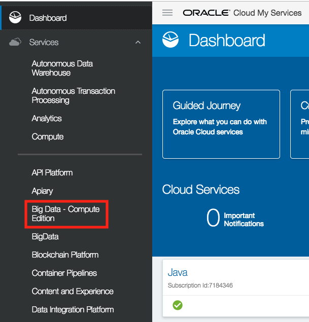
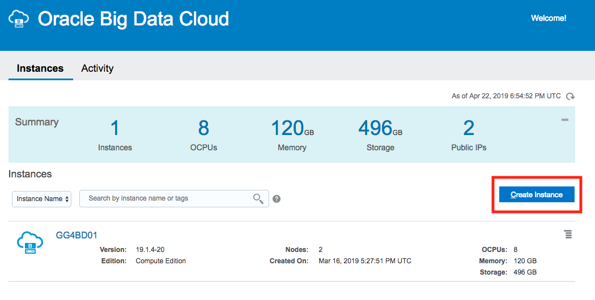
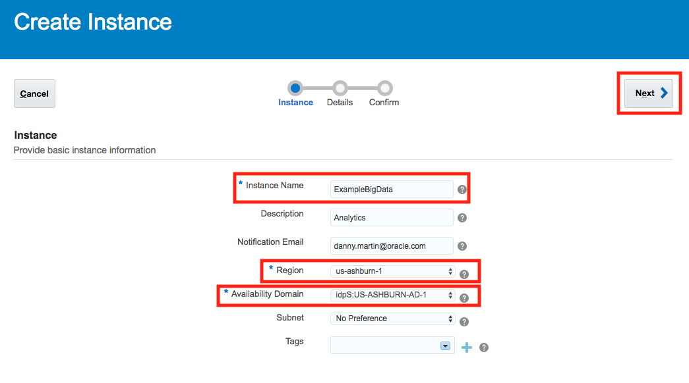
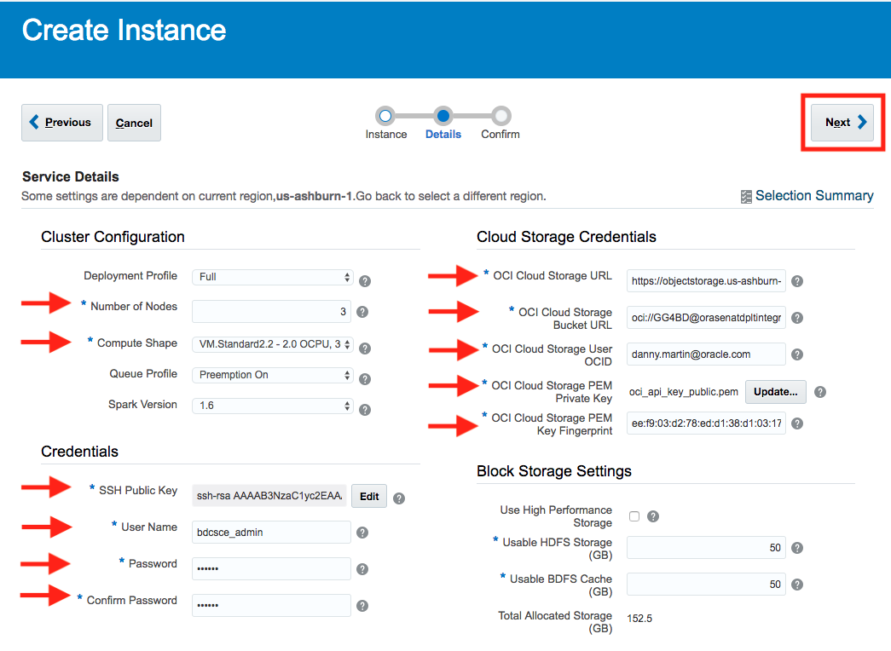
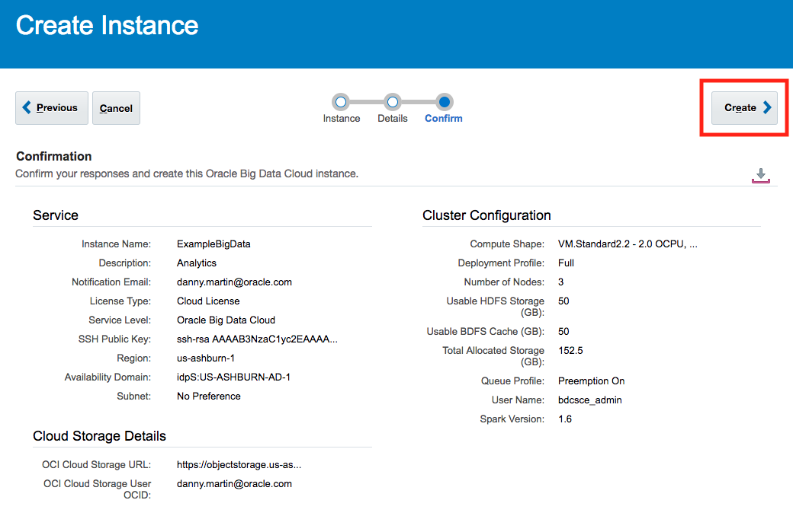
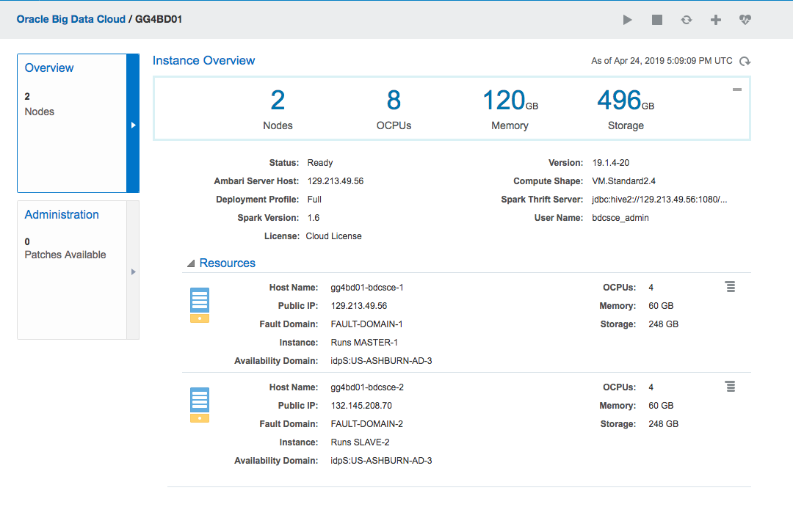

# Lab 100 -  Provision Golden Gate for Big Data

## Before You Begin

### Introduction
Provision Big Data Cloud instance through Oracle Cloud. This instance will be used in labs within this workshop and will be important to understand how to provision as you begin working in Big Data space using Oracle Cloud.

### Objectives
- Provision Big Data Cloud instance

### Time to Complete
Approximately 10 minutes

### What Do You Need?
Your will need:
- Oracle Cloud URL
- Oracle Cloud User and Password

## Creating Big Data Cloud

1. First we need to navigate to the Big Data Cloud page

2. Below we are able to review other Big Data Cloud Clusters that we have created as well as create a new one. Let's select **Create Instance**

3. Below we will fill out some basic information to get us started. If you fill out the notification email, you will receive an email once the instance is officially created.

4. **This page below requires a few more fields be filled out. **

We will need to specify:
- Number of Nodes
- Compute Shape
- SSH Public Key - This can be generated by selecting edit if you would like to create a new one
- User Name - default is bdcsce_admin
- Password
- OCI Cloud Storage URL - ex. https://objectstorage.us-ashburn-1.oraclecloud.com/
- OCI Cloud Storage Bucket URL - ex. oci://bucket@namespace/
- OCI Cloud Storage User OCID - ex. ocid1.user.oc1..aaaaaaaa6qk6h6ftjxxxxxxxxxxxxxxxxxxxxcwqi6pw26yiy4rda
- OCI Cloud Storage PEM Private Key - This is the private key associated with the user specified with the User OCID
- OCI Cloud Storage PEM Key Fingerprint

Select **'Next'**

5. Below is a basic screen to review our instance details we have entered throughout this lab. If everything looks good, then we will select 'Create' and the Big Data Cloud instance will begin creating. This process can take up to 30 minutes

6. Once our instance has finished provisioning we can select it and view some more details like the Master Node's IP Address, as well as the Spark Thrift Server and the Ambari Server Host.

