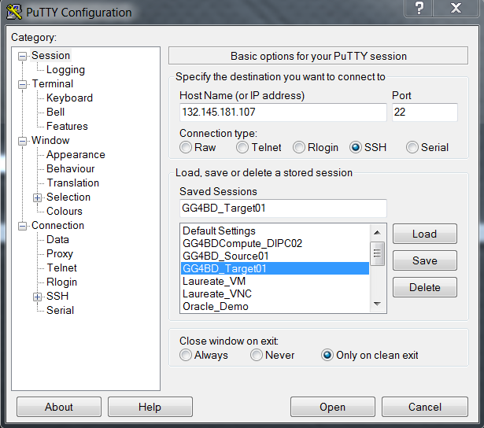
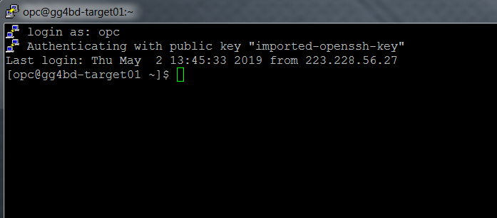

# Lab 100 -  Installation of Golden Gate for Big Data


## Before You Begin

### Introduction
Installation of Golden Gate for Big Data simplifies your data integration by working with on-premises and cloud data source/targets and accepting data in any shape or format. This lab will guide you on how to Install Goldengate for BigData.

### Objectives
- Installation of Golden Gate for Big Data 12.3.2.1

### Time to Complete
Approximately 30 minutes

### What Do You Need?
Your will need:
- Golden Gate for Big Data 12.3.2.1
- Java jdk1.8

### STEP 1: Access Ravello Image or Cloud Mchine via putty

In this step you will use putty client to connect to Oracle Cloud Compte environment, to get started with the installation of Oracle GoldenGate Big Data.

1. Connect to Oracle Compute instance with public ip and private key



2. Load the private key given to you by the instructor in the putty 


3. Enter the username as opc and you would be logged in




### STEP 2: Verify and prepare for the Installation

1. Sudo into the oracle user and Verify the environment variables as java jdk would be already installed and environment variables should be set already. Below are the sample environment variables.

```
export ORACLE_HOME=/u01/app/oracle/product/12.2.0/dbhome_1
export GGBD_HOME=/u01/app/ggbd_home1
export TNS_ADMIN=$ORACLE_HOME/network/admin
export JAVA_HOME=/usr/java/jdk1.8.0_201-amd64
export JRE_HOME=/usr/java/jdk1.8.0_201-amd64/jre
export PATH=/usr/sbin:$ORACLE_HOME/bin:$JAVA_HOME/bin:$PATH
export LD_LIBRARY_PATH=$JAVA_HOME/jre/lib/amd64/server:$JAVA_HOME/lib:$ORACLE_HOME/lib
export CLASSPATH=$JAVA_HOME/lib:/u01/app/ggbd_home1/ggjava
```


