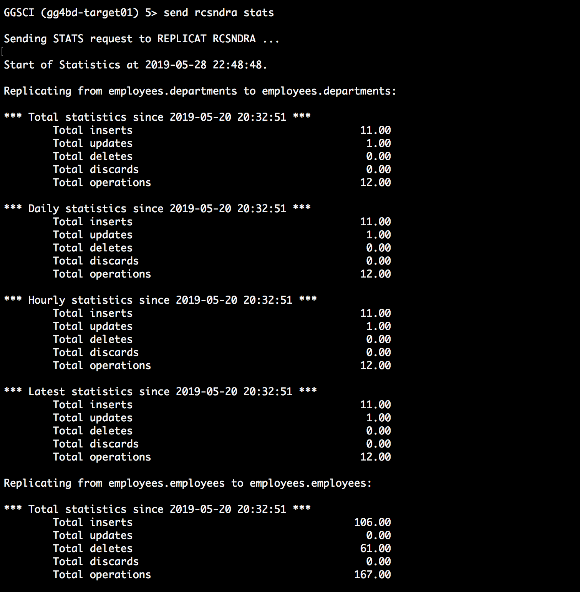

# Lab 1000 -  MySQL to Cassandra

## Before You Begin

### Introduction
In this lab we will use goldengate for Cassandra to capture data from MySQL

### Objectives
- Goldengate replication for Cassandra to capture CDC from MySQL

### Time to Complete
Approximately 30 minutes

### What Do You Need?
You will need:
- Cassandra already installed and configured.
- Oracle Goldengate for Mysql -MySQL database.

## Replicat from trail files on the target machine to Cassandra Keyspace.

1. We already have a trail file created in the GGBD home. We will be using the same trail file to replicate to OCI Object Storage.

Please refer to Lab 400 for more information.

2. Create the csndra.props file in dirprm folder in your Golden Gate installation folder and edit the file.
```
[oracle@gg4bd-target01 ggbd_home1]$ cd dirprm
[oracle@gg4bd-target01 dirprm]$ vi csndra.props
```
Copy paste the below text in csndra.props.

```
#RCSNDRA Properties for Cassandra
#
gg.handlerlist=cassandra
#The handler properties
gg.handler.cassandra.type=cassandra
gg.handler.cassandra.mode=op
gg.handler.cassandra.contactPoints=localhost
gg.handler.cassandra.ddlHandling=CREATE,ADD,DROP
gg.handler.cassandra.compressedUpdates=false
gg.handler.cassandra.cassandraMode=async
gg.handler.cassandra.consistencyLevel=ONE
goldengate.userexit.timestamp=utc
goldengate.userexit.writers=javawriter
javawriter.stats.display=TRUE
javawriter.stats.full=TRUE
##
gg.log=log4j
gg.log.level=INFO
###      
gg.report.time=30sec
###      
gg.classpath=dirprm/:/u01/app/cassandra/lib/*:/u01/app/cassandra/lib/cassandra-javadriver/*:/u01/app/cassandra/lib/cassandra-javadriver/lib/*

javawriter.bootoptions=-Xmx512m -Xms32m -Djava.class.path=ggjava/ggjava.jar
##

```
Save the text using wq!

3. Edit rcsndra.prm file.
```
[oracle@gg4bd-target01 dirprm]$ vi rcsndra.prm
```
Copy the following text into the rcsndra.prm file.
```
REPLICAT RCSNDRA
------------------------------------------------------------------------------------
-----
-- Trail file for this example is located in "AdapterExamples/trail" directory
-- Command to add REPLICAT
-- add replicat RCSNDRA, exttrail ./dirdat/eb
------------------------------------------------------------------------------------
-----
TARGETDB LIBFILE libggjava.so SET property=dirprm/csndra.props
REPORTCOUNT EVERY 1 MINUTES, RATE
GROUPTRANSOPS 1000
MAP employees.*, TARGET employees.*;
```
Save the text and quit using wq!

4. Now come back from the dirprm folder and run ./ggsci
```
[oracle@gg4bd-target01 dirprm]$ cd ..
[oracle@gg4bd-target01 ggbd_home1]$ ./ggsci
```
5. Add the replicat with the below command.

```
add replicat RCSNDRA, exttrail ./dirdat/eb

```
6. And now start the replicat. It should appear as below.
```
GGSCI (gg4bd-target01) 1> add replicat RCSNDRA, exttrail ./dirdat/eb
GGSCI (gg4bd-target01) 3> start RCSNDRA
GGSCI (gg4bd-target01) 4> info all
```


7. Once the replicat is started and running, everything is ready for replication. To see the statistics of the data being replicated, issue the following command in ./ggsci




## Test if the data in Mysql database gets replicated in cassandra.

1. Go to the cassandra Installation folder.

```
[[oracle@gg4bd-target01 app]$ cd cassandra/
[oracle@gg4bd-target01 cassandra]$ ls
bin  CASSANDRA-14092.txt  CHANGES.txt  conf  data  doc  interface  javadoc  lib  LICENSE.txt  logs  NEWS.txt  NOTICE.txt  pylib  tools
```
2. Start the cassandra server using the below command. Make sure that the server is running, when you are trying to replicate the changes.

```
[oracle@gg4bd-target01 cassandra]$ cd bin
[oracle@gg4bd-target01 bin]$ ./cassandra -f
```
3. Open another terminal and go to the same cassandra folder, go to bin and start connecting to the cassandra server using cqlsh.
```
[oracle@gg4bd-target01 cassandra]$ cd bin
[oracle@gg4bd-target01 bin]$ ls
cassandra         cqlsh.py         sstableloader.bat   sstableverify
cassandra.bat     debug-cql        sstablescrub        sstableverify.bat
cassandra.in.bat  debug-cql.bat    sstablescrub.bat    stop-server
cassandra.in.sh   nodetool         sstableupgrade      stop-server.bat
cassandra.ps1     nodetool.bat     sstableupgrade.bat  stop-server.ps1
cqlsh             source-conf.ps1  sstableutil
cqlsh.bat         sstableloader    sstableutil.bat
[oracle@gg4bd-target01 bin]$ cqlsh localhost
Connected to Test Cluster at localhost:9042.
[cqlsh 5.0.1 | Cassandra 3.11.4 | CQL spec 3.4.4 | Native protocol v4]
Use HELP for help.
cqlsh>

```
4. And here when to try to query the departments table in the employee schema, the result will appear as below.


### Troubleshooting:

1. The schemas in RDMS database are similar to keyspaces in Cassandra. If you receive an error saying that the
primary keys are immutable. Probably it is a keyspace issue. So create a keyspace name in cassandra similar to the schema name in Mysql.
