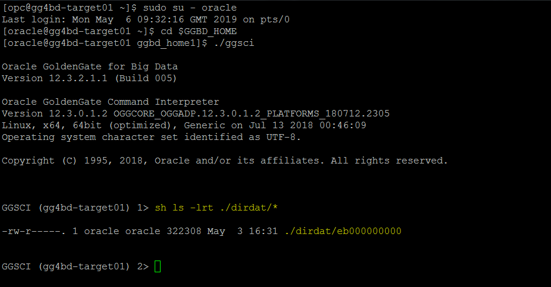
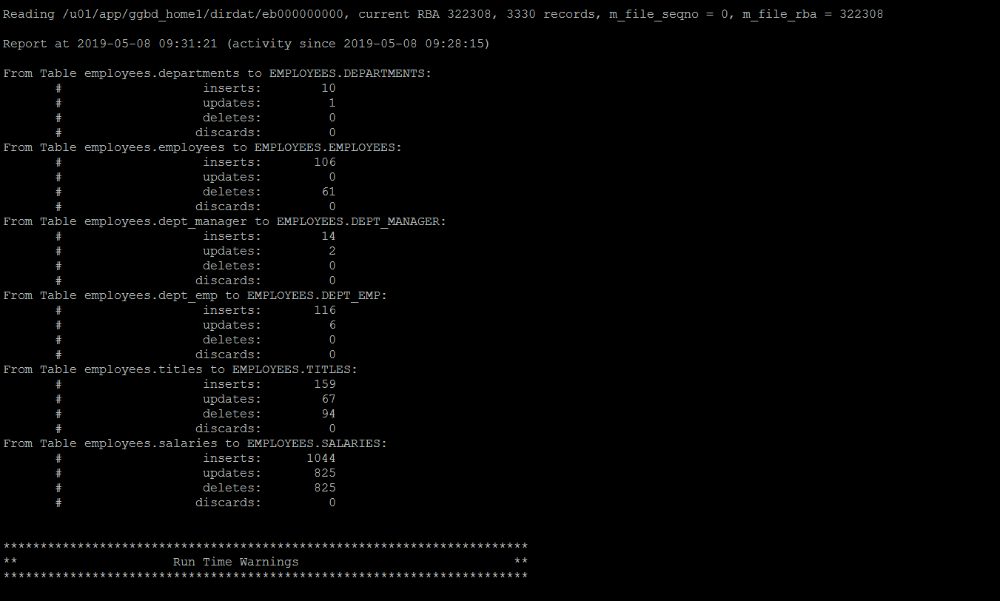
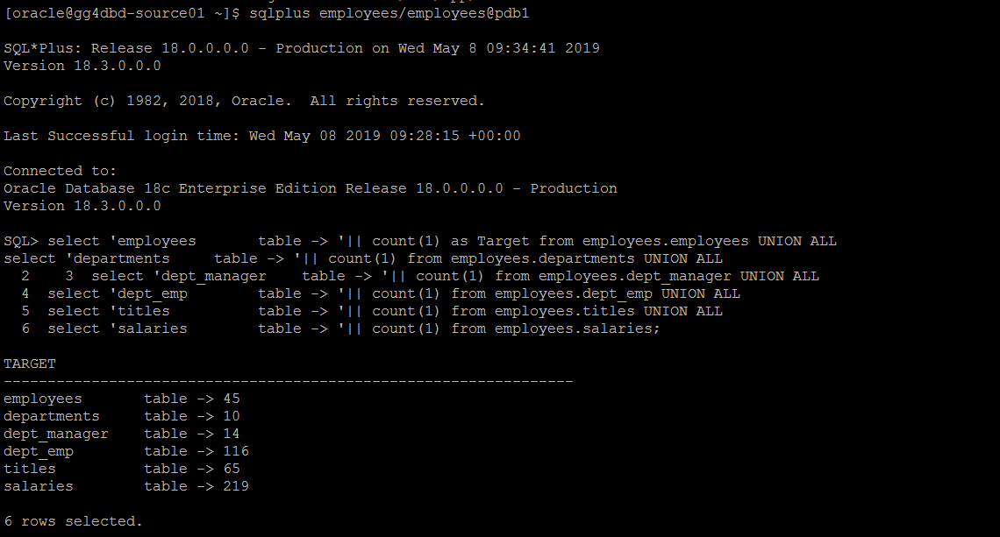

# Lab 1100 -  MySQL to Oracle (using jdbc)


## Before You Begin

### Introduction
In this lab we will use goldengate for bigdata Java Database Connectivity (JDBC) Handler to replicate source transactional data to a target or database.

### Objectives
- Provision Provision Golden Gate for Big Data 

### Time to Complete
Approximately 30 minutes

### What Do You Need?
Your will need:
- Goldengate for Bigdata
- Oracle JDBC Java Driver

### STEP 1: Setting up the Environment For Connection to OCI Cloud.

1. We already have a trail file created in the GGBD home. We will be using the same trail file to replicate to OCI Object Storage.



Please refer to Lab 400 for more information.

2. In this step we will download the oracle jdbc jar and create a directory and unzip the files in that directory.

        We already have the jdbc drive downloaded ojdbc8-full.tar.gz in the location /home/oracle/Downloads 
```
[opc@gg4bd-target01 ~]$ sudo su - oracle
Last login: Tue May  7 14:53:22 GMT 2019 on pts/3
[oracle@gg4bd-target01 ~]$ mkdir -p /u01/app/jars/oracle_jdbc

[oracle@gg4bd-target01 ~]$ cd /u01/app/jars/oracle_jdbc
[oracle@gg4bd-target01 oracle_jdbc]$ cp /home/oracle/Downloads/ojdbc8-full.tar.gz /u01/app/jars/oracle_jdbc/

[oracle@gg4bd-target01 oracle_jdbc]$ ls -lrt
total 7532
-rwxr-xr-x. 1 oracle oracle 7709868 May  7 14:57 ojdbc8-full.tar.gz

[oracle@gg4bd-target01 oracle_jdbc]$ tar -xvzf ojdbc8-full.tar.gz
```
    
3. Add the replicat with the below commands by logging into ggsci prompt

```
GGSCI (gg4bd-target01) 4> add replicat rjdbc, exttrail ./dirdat/eb
REPLICAT added.

GGSCI (gg4bd-target01) 5> edit param rjdbc
```

Add the below parameters in the parameter file :

```
REPLICAT rjdbc
----------------------------------------------------------------------------------------
-- Trail file for this example is located in "AdapterExamples/trail" directory
-- Command to add REPLICAT
-- add replicat rjdbc, exttrail ./dirdat/eb
--TARGETDB LIBFILE libggjava.so SET property=dirprm/jdbc_mysql_with_mdp.props
----------------------------------------------------------------------------------------
TARGETDB LIBFILE libggjava.so SET property=dirprm/jdbc_oracle_with_mdp.props
REPORTCOUNT EVERY 1 MINUTES, RATE
GROUPTRANSOPS 1000

REPERROR DEFAULT, DISCARD
DISCARDFILE ./dirrpt/rjdbc.dsc, APPEND

MAP employees.employees,    TARGET EMPLOYEES.EMPLOYEES,   KEYCOLS(EMP_NO);
MAP employees.departments,  TARGET EMPLOYEES.DEPARTMENTS, KEYCOLS(DEPT_NO);
MAP employees.dept_manager, TARGET EMPLOYEES.DEPT_MANAGER,KEYCOLS(EMP_NO,DEPT_NO);
MAP employees.dept_emp,     TARGET EMPLOYEES.DEPT_EMP,    KEYCOLS(EMP_NO,DEPT_NO);
MAP employees.titles,       TARGET EMPLOYEES.TITLES,      KEYCOLS(EMP_NO,TITLE,FROM_DATE);
MAP employees.salaries,     TARGET EMPLOYEES.SALARIES,    KEYCOLS(EMP_NO,FROM_DATE);
```

4. Now edit the dirprm/jdbc_oracle_with_mdp.props file with the below parameters. You can use sample property files found in $GGBD_HOME/AdapterExamples/big-data/jdbc.

```
GGSCI (gg4bd-target01) 8> exit
[oracle@gg4bd-target01 ggbd_home1]$ cd dirprm
[oracle@gg4bd-target01 dirprm]$ vi jdbc_oracle_with_mdp.props
```

Below are the parametrs we will be using.
```
gg.handlerlist=jdbcwriter
gg.handler.jdbcwriter.type=jdbc

#Handler properties for Oracle database target with JDBC Metadata provider
gg.handler.jdbcwriter.DriverClass=oracle.jdbc.driver.OracleDriver
gg.handler.jdbcwriter.connectionURL=jdbc:oracle:thin:@129.213.97.81:1521/PDB1
gg.handler.jdbcwriter.userName=employees
gg.handler.jdbcwriter.password=employees
gg.classpath=/u01/app/jars/oracle_jdbc/ojdbc8-full/ojdbc8.jar
#JDBC Metadata provider for Oracle target
gg.mdp.type=jdbc
gg.mdp.ConnectionUrl=jdbc:oracle:thin:@129.213.97.81:1521/PDB1
gg.mdp.DriverClassName=oracle.jdbc.driver.OracleDriver
gg.mdp.UserName=employees
gg.mdp.Password=employees


goldengate.userexit.writers=javawriter
javawriter.stats.display=TRUE
javawriter.stats.full=TRUE
gg.log=log4j
gg.log.level=INFO
gg.report.time=30sec
javawriter.bootoptions=-Xmx512m -Xms32m -Djava.class.path=.:ggjava/ggjava.jar:./dirprm
```

5. Now Goto ggsci command prompt and start the replicat. We can see the stats of the replicat



And we can goto the database and see the record count as well. For that log in to GG4BD_Source01 (129.213.97.81)

```
[opc@gg4dbd-source01 ~]$ sudo su - oracle
Last login: Wed May  8 09:22:55 GMT 2019 on pts/6
[oracle@gg4dbd-source01 ~]$ . oraenv
ORACLE_SID = [cdb1] ?
The Oracle base remains unchanged with value /u01/app/oracle
[oracle@gg4dbd-source01 ~]$ sqlplus employees/employees@pdb1
```

Now run the below script to get the tables counts

```
select 'employees       table -> '|| count(1) as Target from employees.employees UNION ALL
select 'departments     table -> '|| count(1) from employees.departments UNION ALL
select 'dept_manager    table -> '|| count(1) from employees.dept_manager UNION ALL
select 'dept_emp        table -> '|| count(1) from employees.dept_emp UNION ALL
select 'titles          table -> '|| count(1) from employees.titles UNION ALL
select 'salaries        table -> '|| count(1) from employees.salaries;
```



You have completed lab 1100! Great Job!