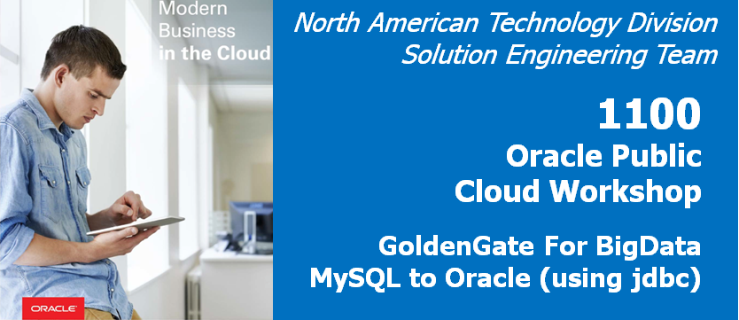

# Lab 1100 -  MySQL to Oracle (using jdbc)

## Before You Begin

### Introduction
In this lab we will use goldengate for bigdata Java Database Connectivity (JDBC) Handler to replicate source transactional data to a target or database.

### Objectives
- Provision Provision Golden Gate for Big Data 

### Time to Complete
Approximately 30 minutes

### What Do You Need?
Your will need:
- Oracle Cloud URL
- Oracle Cloud User and Password
