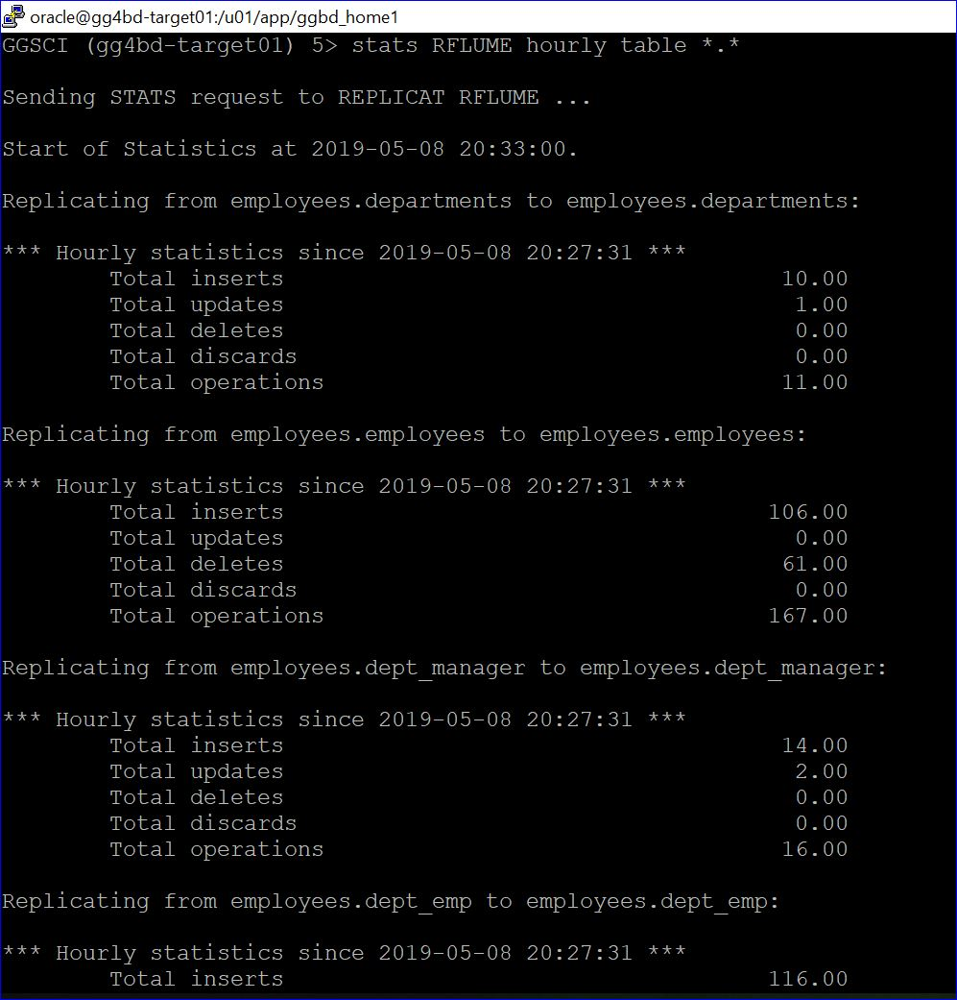
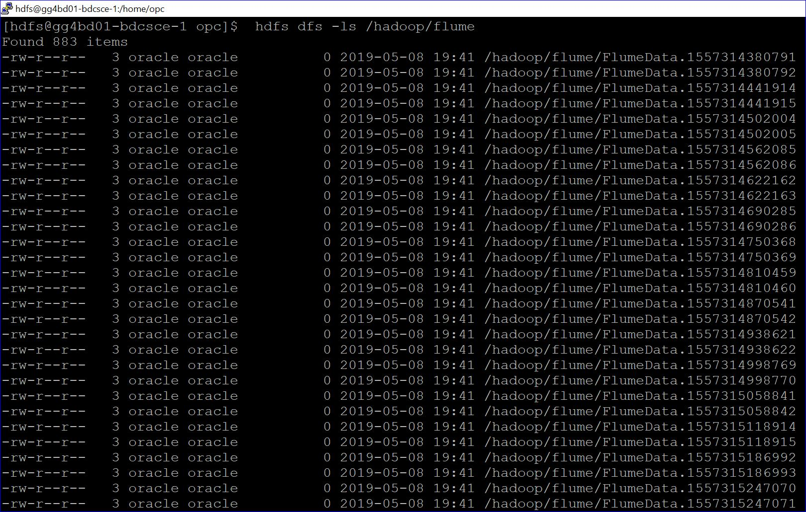

# Lab 1300 -  MySQL to MongoDB


## Before You Begin

### Introduction
Provision Golden Gate for Big Data simplifies your data integration by working with on-premises and cloud data source/targetss and accepting data in any shape or format. This lab will guide you on how to replicate data to mongodb usign Goldengate for Big Data.

### Objectives
- Provision Provision Golden Gate for Big Data 

### Time to Complete
Approximately 60 minutes

### What Do You Need?
Your will need:
-Oracle Goldengate for Bigdata
-Mongo DB Binary Files.


### STEP 1: Setting up the Environment For Connection to Apache Flume.
    
In this step we will Download and set up Mongo DB.  

1. Download the Mongo DB binaries using curl command .


2. Untar the downloaded MongoDB Binaries.

3. Rename the unzipped mongoDB directory from mongodb-linux-x86_64-3.4.7 to mongodb .

4. Traverse into the directory renamed in last step and create a sub directory as     data.

  

5. Traverse to bin directory under mongodb, and startuup the Mongodb instance.


6. As soon as the MongoDB instance is up and running, it would be Waiting for connections on port 27017 . The default port for mongoDb is 27017.


7. Copy the mongodb java driver(mongo-java-driver-3.4.3.jar) to the goldengate installation directory.


8. Once you do that, make sure you have set JAVA_HOME and LD_LIBRARY_PATH and goldengate home directory looks like below with all neessary files:


9. Copy the MongoDb Replicat parameter and properties file from default AdapterExamples directory to dirprm.
[If you haven't executed "create subdir" command before then do it now by going to goldengate software command Intrepreter- ./ggsci, which would create all the necessary subdirectories of Goldengate]


10. Edit the mongodb Replicat properties file in dirprm subdirectory to include correct gg classpath to mongodb java driver and other required properties.Your mongodb replicat properties file looks like this:


11. Edit the mongodb replicat parameter file in dirprm subdirectory to include correct table/schema name in MAP statement.Here we are replicating table data of tables in employees schema.


12. Login into goldengate software command Intrepreter(./ggsci) and add a replicat in order to replicate data from mysql trails into Mongodb.


13. Start the replicat and check the status of the replicat by executing the info command and make sure the Replicat status is running and RBA has moved over 0.


14. Exit from Goldengate command prompt and go to bin subdirectory under Mongodb directory created earlier. Execute ./mongo command to login into mongodb.


You can see it has connected to mongodb://127.0.0.1:27017 and Mongodb version is 3.4.7.

15. To List all the databases in mongoDB console use the command show dbs.As you can see we have a Database named employees in the list. Use the comaand "use <database-name>" to  switch to a particular database.


16. You can view the data that has been replicated by Goldengate replicat using the command- "db.<database-name>.find()". It will list all the records that have been present in the specific database.


```
[oracle@gg4bd-target01 ~]$ cd /u01/app/flume/
[oracle@gg4bd-target01 flume]$ sh flume_agent.sh &
[1] 17159
[oracle@gg4bd-target01 flume]$ 
```


### STEP 2: Goldengate Replicat Setup for delimitedtext format in OCI Obejct Storage.

1. We already have a trail file created in the GGBD home. We will be using the same trail file to replicate to Apache flume .


2. Add the replicat with the below commands.

```
GGSCI (gg4bd-target01) 4> add replicat rflume, exttrail ./dirdat/eb
REPLICAT added.

GGSCI (gg4bd-target01) 5> edit param rflume
```

Add the below parameters in the parameter file :
```
REPLICAT rflume
-----------------------------------------------------------------------------------------
-- Trail file for this example is located in "AdapterExamples/trail" directory
-- Command to add REPLICAT
-- add replicat rflume, exttrail ./dirdat/eb
-- SETENV(GGS_JAVAUSEREXIT_CONF = 'dirprm/flume.props')
-----------------------------------------------------------------------------------------
TARGETDB LIBFILE libggjava.so SET property=dirprm/flume.props
REPORTCOUNT EVERY 1 MINUTES, RATE
GROUPTRANSOPS 1000
MAP employees.*, TARGET employees.*;
```

3. Now edit the dirprm/rfwcsv.props file with the below parameters. You can use sample property files found in $GGBD_HOME/AdapterExamples/big-data/flume.

```
GGSCI (gg4bd-target01) 8> exit
[oracle@gg4bd-target01 ggbd_home1]$ cd dirprm
[oracle@gg4bd-target01 dirprm]$ vi flume.props
```

Below are the parametrs we will be using.

```

gg.handlerlist = flumehandler
gg.handler.flumehandler.type=flume
gg.handler.flumehandler.RpcClientPropertiesFile=custom-flume-rpc.properties
gg.handler.flumehandler.format=avro_op
gg.handler.flumehandler.mode=tx
#gg.handler.flumehandler.maxGroupSize=100, 1Mb
#gg.handler.flumehandler.minGroupSize=50, 500 Kb
gg.handler.flumehandler.EventMapsTo=tx
gg.handler.flumehandler.PropagateSchema=true
gg.handler.flumehandler.includeTokens=false
gg.handler.flumehandler.format.WrapMessageInGenericAvroMessage=true

goldengate.userexit.writers=javawriter
javawriter.stats.display=TRUE
javawriter.stats.full=TRUE

gg.log=log4j
gg.log.level=INFO

gg.report.time=30sec

#Sample gg.classpath for Apache Flume
gg.classpath=dirprm/:/u01/app/flume/lib/*:
#Sample gg.classpath for CDH
#gg.classpath=/etc/flume-ng/conf:/opt/cloudera/parcels/CDH/lib/flume-ng/lib/*
#Sample gg.classpath for HDP
#gg.classpath=/etc/flume/conf:/usr/hdp/current/flume-server/lib/*

javawriter.bootoptions=-Xmx512m -Xms32m -Djava.class.path=ggjava/ggjava.jar

#Set the classpath here
#User TODO - Need the AWS Java SDK, Parquet Dependencies, HDFS Client Dependencies
gg.classpath=/u01/app/jars/oci_libs/oci/lib/*:/u01/app/jars/oci_libs/oci/third-party/lib/*
javawriter.bootoptions=-Xmx512m -Xms32m -Djava.class.path=.:ggjava/ggjava.jar:./dirprm
```

4. Now goto ggsci prompt and you will see the replicat rflume. start the replicat and see the data in the Apache Flume.



5. You will be able to see the files created in Apache Flume.




You have completed lab 1400! Great Job!