# Lab 1300 -  MySQL to MongoDB
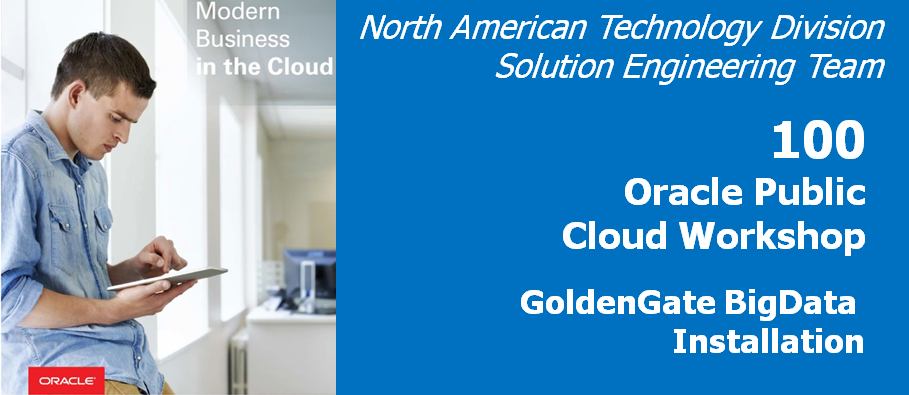


## Before You Begin

### Introduction
Provision Golden Gate for Big Data simplifies your data integration by working with on-premises and cloud data source/targetss and accepting data in any shape or format. This lab will guide you on how to replicate data to mongodb usign Goldengate for Big Data.

### Objectives
- Replicate from MySQL to MongoDB

### Time to Complete
Approximately 60 minutes

### What Do You Need?
Your will need:
-Oracle Goldengate for Bigdata
-Mongo DB Binary Files.


### STEP 1: Setting up the Environment For Connection to MongoDB.
    
In this step we will Download and set up Mongo DB.  

1. Download the Mongo DB binaries using curl command .

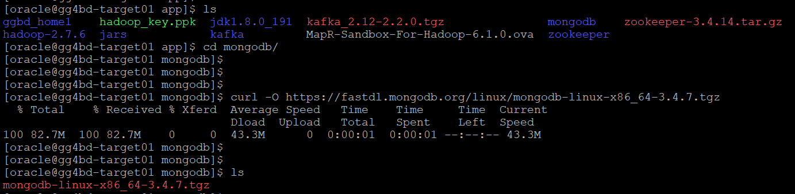

2. Untar the downloaded MongoDB Binaries.

3. Rename the unzipped mongoDB directory from mongodb-linux-x86_64-3.4.7 to mongodb .

4. Traverse into the directory renamed in last step and create a sub directory as     data.

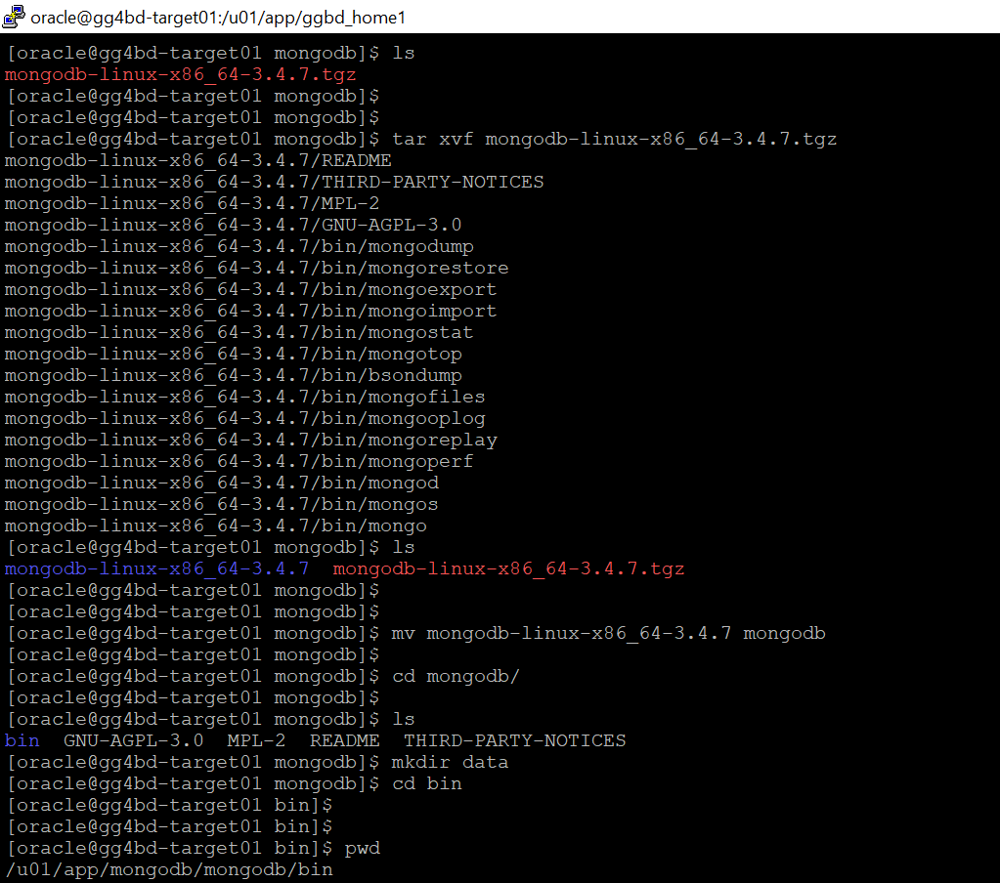  

5. Traverse to bin directory under mongodb, and startuup the Mongodb instance.

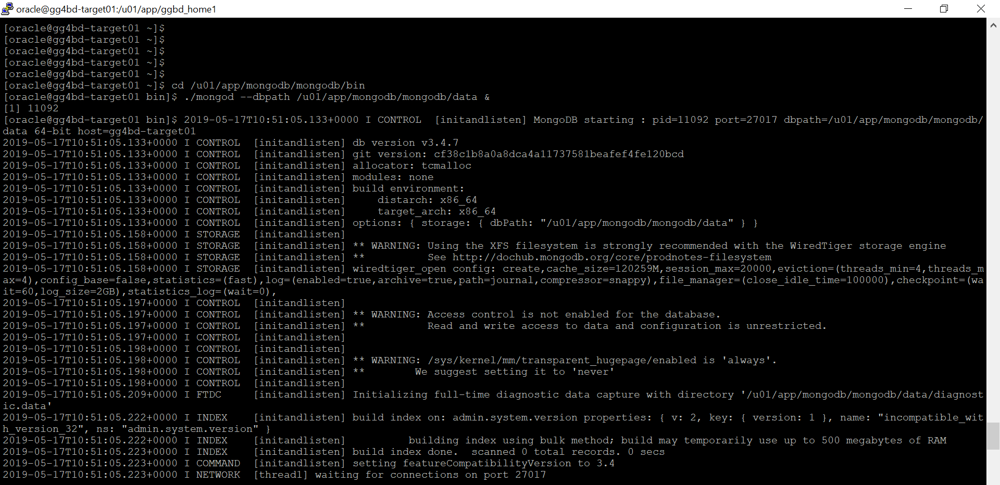

6. As soon as the MongoDB instance is up and running, it would be Waiting for connections on port 27017 . The default port for mongoDb is 27017.


7. Copy the mongodb java driver(mongo-java-driver-3.4.3.jar) to the goldengate installation directory.

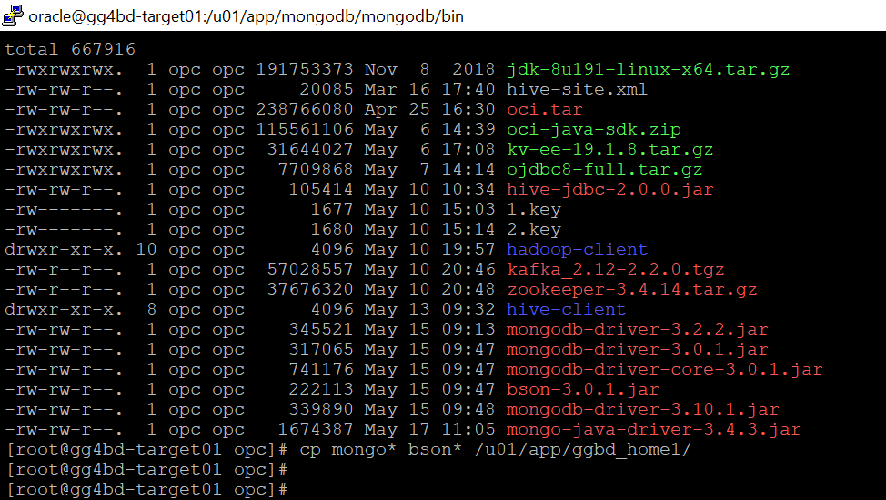

8. Once you do that, make sure you have set JAVA_HOME and LD_LIBRARY_PATH and goldengate home directory looks like below with all neessary files:

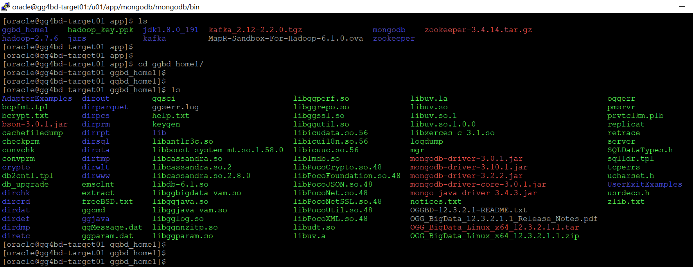

9. Copy the MongoDb Replicat parameter and properties file from default AdapterExamples directory to dirprm.
[If you haven't executed "create subdir" command before then do it now by going to goldengate software command Intrepreter- ./ggsci, which would create all the necessary subdirectories of Goldengate]

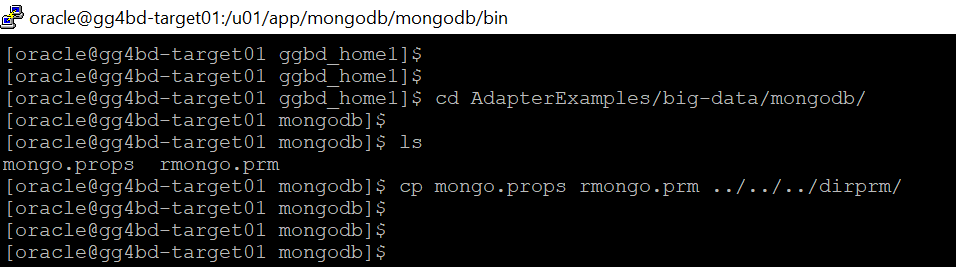

10. Edit the mongodb Replicat properties file in dirprm subdirectory to include correct gg classpath to mongodb java driver and other required properties.Your mongodb replicat properties file looks like this:

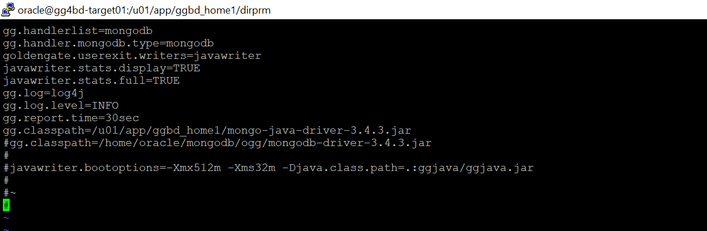

11. Edit the mongodb replicat parameter file in dirprm subdirectory to include correct table/schema name in MAP statement.Here we are replicating table data of tables in employees schema.

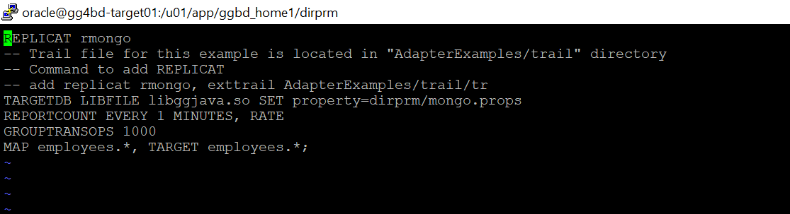


12. Login into goldengate software command Intrepreter(./ggsci) and add a replicat in order to replicate data from mysql trails into Mongodb.

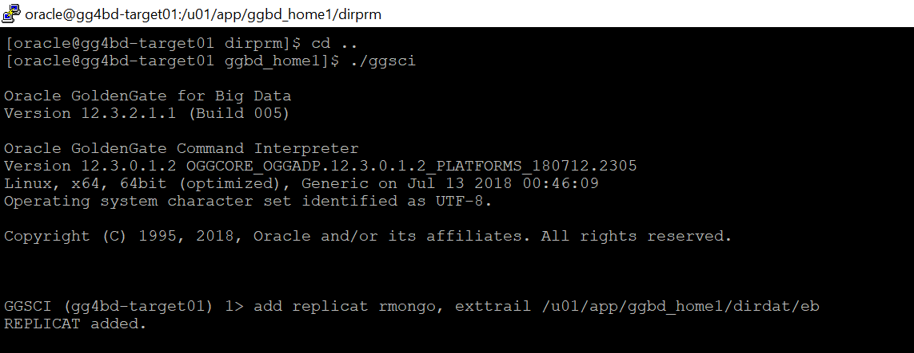

13. Start the replicat and check the status of the replicat by executing the info command and make sure the Replicat status is running and RBA has moved over 0.

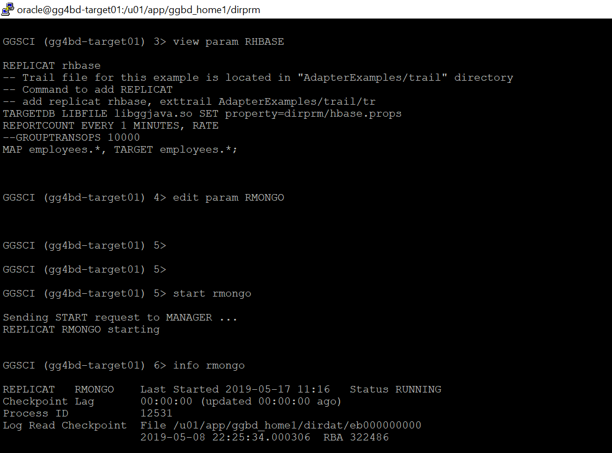

14. Exit from Goldengate command prompt and go to bin subdirectory under Mongodb directory created earlier. Execute ./mongo command to login into mongodb.

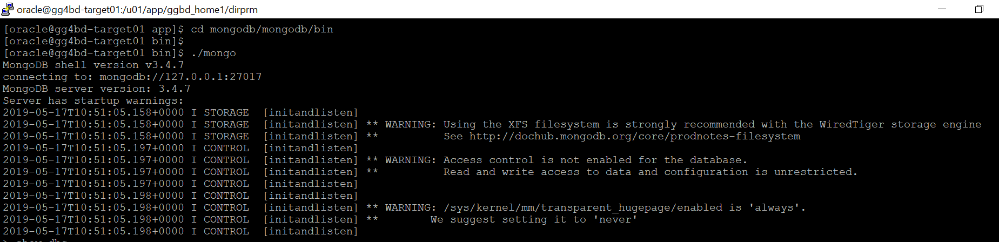

You can see it has connected to mongodb://127.0.0.1:27017 and Mongodb version is 3.4.7.

15. To List all the databases in mongoDB console use the command show dbs.As you can see we have a Database named employees in the list. Use the comaand "use <database-name>" to  switch to a particular database.

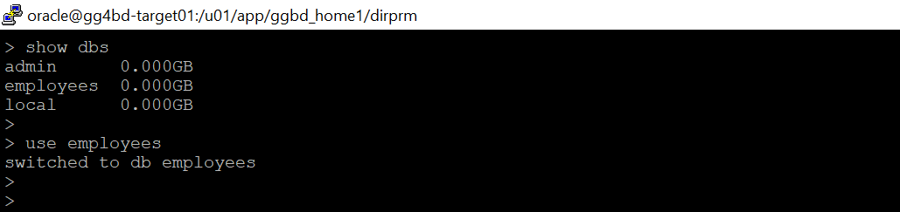

16. You can view the data that has been replicated by Goldengate replicat using the command- "db.<database-name>.find()". It will list all the records that have been present in the specific database.

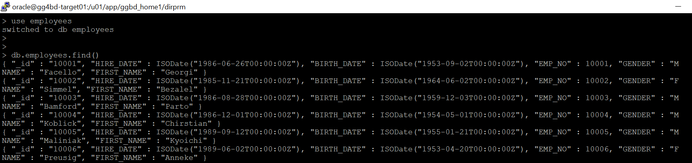


### STEP 2: Setting up the Environment For MySQL.
    
In this step we will configuring the environment,which is done by editing ASCII files and running OS utilitiesMySQL.  

1. Edit the MySQL server configuration file,which is exist at /etc/my.cnf.

```
datadir=/var/lib/mysql
socket=/var/lib/mysql/mysql.sock
log-error=/var/log/mysqld.log
pid-file=/var/run/mysqld/mysqld.pid
default_authentication_plugin=mysql_native_password
```

### STEP 3: Goldengate Replicat Setup for base extract and pump before setting up replicat .

1. Configuring the Primary Extract .

```
[oracle@gg4dbd-source01 ~]$ cd /u01/app/oracle/product/18.1.0_GGMySQL
[oracle@gg4dbd-source01 18.1.0_GGMySQL]$ ./ggsci

Oracle GoldenGate Command Interpreter for MySQL
Version 18.1.0.0.0 OGGCORE_18.1.0.0.0_PLATFORMS_180928.0432
Linux, x64, 64bit (optimized), MySQL Enterprise on Sep 28 2018 19:34:16
Operating system character set identified as UTF-8.

Copyright (C) 1995, 2018, Oracle and/or its affiliates. All rights reserved.


GGSCI (gg4dbd-source01) 1> ADD EXTRACT E_MYSQL, TRANLOG, BEGIN NOW
EXTRACT added.

GGSCI (gg4dbd-source01) 2> edit param E_MYSQL
```

Add the below parameters in the parameter file :
```
EXTRACT E_MYSQL
--------------------------------------------------------------------------
-- ADD EXTRACT E_MYSQL, TRANLOG, BEGIN NOW
-- ADD EXTTRAIL ./dirdat/ea, EXTRACT E_MYSQL
--------------------------------------------------------------------------
SETENV (MYSQL_HOME='/var/lib/mysql')
SETENV (MYSQL_UNIX_PORT='/var/lib/mysql/mysql.sock')
GETENV (MYSQL_HOME)
GETENV (MYSQL_TCP_PORT)
GETENV (MYSQL_UNIX_PORT)
sourcedb employees,userid ggbd,password W3lcome_123#
reportcount every 60 seconds, rate
EXTTRAIL ./dirdat/ea
TRANLOGOPTIONS ALTLOGDEST "/var/lib/mysql/binlog.index"
--TRANLOGOPTIONS ALTLOGDEST REMOTE
GETTRUNCATES;
TABLE employees.employees;
TABLE employees.departments;
TABLE employees.dept_manager;
TABLE employees.dept_emp;
TABLE employees.titles;
TABLE employees.salaries;

```

3. Start the Primary Extract E_MYSQL.

```
GGSCI (gg4dbd-source01) 3> start E_MYSQL

Sending START request to MANAGER ...
EXTRACT E_MYSQL starting


GGSCI (gg4dbd-source01) 4> info all

Program     Status      Group       Lag at Chkpt  Time Since Chkpt

MANAGER     RUNNING
EXTRACT     RUNNING     E_MYSQL     00:00:00      00:00:03

```

4. Configuring the Secondary Extract (PUMP).

```
[oracle@gg4dbd-source01 ~]$ cd /u01/app/oracle/product/18.1.0_GGMySQL
[oracle@gg4dbd-source01 18.1.0_GGMySQL]$ ./ggsci

Oracle GoldenGate Command Interpreter for MySQL
Version 18.1.0.0.0 OGGCORE_18.1.0.0.0_PLATFORMS_180928.0432
Linux, x64, 64bit (optimized), MySQL Enterprise on Sep 28 2018 19:34:16
Operating system character set identified as UTF-8.

Copyright (C) 1995, 2018, Oracle and/or its affiliates. All rights reserved.


GGSCI (gg4dbd-source01) 1> ADD EXTRACT P_MYSQL, EXTTRAILSOURCE ./dirdat/ea
EXTRACT added.


GGSCI (gg4dbd-source01) 2> ADD RMTTRAIL /tmp/ggbd_home1/dirdat/ac, EXTRACT P_MYSQL
RMTTRAIL added.

GGSCI (gg4dbd-source01) 2> edit param P_MYSQL
```
Add the below parameters in the parameter file :
```
EXTRACT P_MYSQL
--------------------------------------------------------------------------
-- ADD EXTRACT P_MYSQL, EXTTRAILSOURCE ./dirdat/ea
-- ADD RMTTRAIL /tmp/ggbd_home1/dirdat/ac, EXTRACT P_MYSQL
--------------------------------------------------------------------------
--RMTHOST 132.145.181.107, MGRPORT 7100
--RMTTRAIL /u01/app/ggbd_home1/dirdat/eb
RMTHOST 129.213.49.56, MGRPORT 7100
RMTTRAIL /tmp/ggbd_home1/dirdat/ac
PASSTHRU
REPORTCOUNT EVERY 60 SECONDS, RATE

TABLE employees.*;

```

5. Start the Secondary Extract P_MYSQL.

```
GGSCI (gg4dbd-source01) 3> start P_MYSQL

Sending START request to MANAGER ...
EXTRACT P_MYSQL starting


GGSCI (gg4dbd-source01) 4> info all

Program     Status      Group       Lag at Chkpt  Time Since Chkpt

MANAGER     RUNNING
EXTRACT     RUNNING     E_MYSQL     00:00:00      00:00:04
EXTRACT     RUNNING     P_MYSQL     00:00:00      00:00:02

```
### STEP 4:Setting up the Goldengate Replicat for Replication to MongoDB.
    
1. Copy the mongodb java driver(mongo-java-driver-3.4.3.jar) to the goldengate installation directory.


2. Once you do that, make sure you have set JAVA_HOME and LD_LIBRARY_PATH and goldengate home directory looks like below with all neessary files:


3. Copy the MongoDb Replicat parameter and properties file from default AdapterExamples directory to dirprm.
[If you haven't executed "create subdir" command before then do it now by going to goldengate software command Intrepreter- ./ggsci, which would create all the necessary subdirectories of Goldengate]


3. Edit the mongodb Replicat properties file in dirprm subdirectory to include correct gg classpath to mongodb java driver and other required properties.Your mongodb replicat properties file looks like this:


4. Edit the mongodb replicat parameter file in dirprm subdirectory to include correct table/schema name in MAP statement.Here we are replicating table data of tables in employees schema.


You have completed lab 1300! Great Job!
