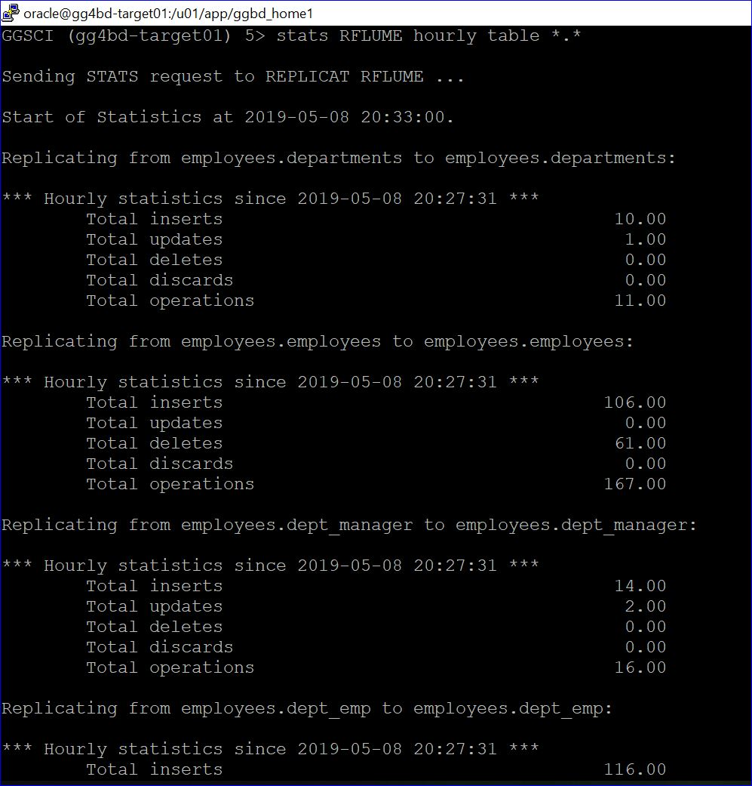
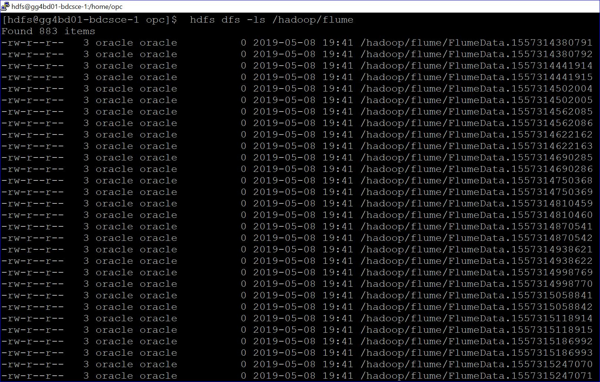

# Lab 1400 -  MySQL to Flume


## Before You Begin

### Introduction
In this lab we will use goldengate for bigdata  to replicate data into Apache Flume.

### Objectives
- Goldengate BigData replication to Apache Flume

### Time to Complete
Approximately 60 minutes

### What Do You Need?
Your will need:
-Oracle Goldengate for Bigdata
-Apache Flume Client and Library files.


### STEP 1: Setting up the Environment For Connection to Apache Flume.
    
In this step we will set up the compute instace to be able to connect to  Apache Flume.  

1. Untar the Flume packages avaliable at "Download" folder.

```
[opc@gg4bd-target01 ~]$ sudo su - oracle
Last login: Mon May  6 09:22:44 GMT 2019 on pts/0
[oracle@gg4bd-target01 ~]$ cd ~/Downloads/
[oracle@gg4bd-target01 Downloads]$ tar -xf flume.tar  -C /u01/app
[oracle@gg4bd-target01 Downloads]$ cd /u01/app
[oracle@gg4bd-target01 app]$ cd flume/
[oracle@gg4bd-target01 flume]$ pwd
/u01/app/flume
```

2. Set enviorment variables for Apache Flume.

```
export HADOOP_HOME=/home/oracle/Software/hadoop-2.7.6
export HADOOP_MAPRED_HOME=$HADOOP_HOME
export HADOOP_COMMON_HOME=$HADOOP_HOME
export HADOOP_HDFS_HOME=$HADOOP_HOME
export YARN_HOME=$HADOOP_HOME
export HADOOP_CONF_DIR=$HADOOP_HOME/etc/hadoop
export PATH=$PATH:$HADOOP_HOME/sbin:$HADOOP_HOME/bin
export FLUME_HOME=/u01/app/flume
export PATH=$PATH:$FLUME_HOME/bin
```

Apache Flume sucessfully installed
```
[oracle@gg4bd-target01 Downloads]$ flume-ng version
Flume 1.9.0
Source code repository: https://git-wip-us.apache.org/repos/asf/flume.git
Revision: d4fcab4f501d41597bc616921329a4339f73585e
Compiled by fszabo on Mon Dec 17 20:45:25 CET 2018
From source with checksum 35db629a3bda49d23e9b3690c80737f9
[oracle@gg4bd-target01 Downloads]$

```

3. Start the flume agent.

```
[oracle@gg4bd-target01 ~]$ cd /u01/app/flume/
[oracle@gg4bd-target01 flume]$ sh flume_agent.sh &
[1] 17159
[oracle@gg4bd-target01 flume]$ 
```


### STEP 2: Goldengate Replicat Setup for delimitedtext format in OCI Obejct Storage.

1. We already have a trail file created in the GGBD home. We will be using the same trail file to replicate to Apache flume .


2. Add the replicat with the below commands.

```
GGSCI (gg4bd-target01) 4> add replicat rflume, exttrail ./dirdat/eb
REPLICAT added.

GGSCI (gg4bd-target01) 5> edit param rflume
```

Add the below parameters in the parameter file :
```
REPLICAT rflume
-----------------------------------------------------------------------------------------
-- Trail file for this example is located in "AdapterExamples/trail" directory
-- Command to add REPLICAT
-- add replicat rflume, exttrail ./dirdat/eb
-- SETENV(GGS_JAVAUSEREXIT_CONF = 'dirprm/flume.props')
-----------------------------------------------------------------------------------------
TARGETDB LIBFILE libggjava.so SET property=dirprm/flume.props
REPORTCOUNT EVERY 1 MINUTES, RATE
GROUPTRANSOPS 1000
MAP employees.*, TARGET employees.*;
```

3. Now edit the dirprm/rfwcsv.props file with the below parameters. You can use sample property files found in $GGBD_HOME/AdapterExamples/big-data/flume.

```
GGSCI (gg4bd-target01) 8> exit
[oracle@gg4bd-target01 ggbd_home1]$ cd dirprm
[oracle@gg4bd-target01 dirprm]$ vi flume.props
```

Below are the parametrs we will be using.

```

gg.handlerlist = flumehandler
gg.handler.flumehandler.type=flume
gg.handler.flumehandler.RpcClientPropertiesFile=custom-flume-rpc.properties
gg.handler.flumehandler.format=avro_op
gg.handler.flumehandler.mode=tx
#gg.handler.flumehandler.maxGroupSize=100, 1Mb
#gg.handler.flumehandler.minGroupSize=50, 500 Kb
gg.handler.flumehandler.EventMapsTo=tx
gg.handler.flumehandler.PropagateSchema=true
gg.handler.flumehandler.includeTokens=false
gg.handler.flumehandler.format.WrapMessageInGenericAvroMessage=true

goldengate.userexit.writers=javawriter
javawriter.stats.display=TRUE
javawriter.stats.full=TRUE

gg.log=log4j
gg.log.level=INFO

gg.report.time=30sec

#Sample gg.classpath for Apache Flume
gg.classpath=dirprm/:/u01/app/flume/lib/*:
#Sample gg.classpath for CDH
#gg.classpath=/etc/flume-ng/conf:/opt/cloudera/parcels/CDH/lib/flume-ng/lib/*
#Sample gg.classpath for HDP
#gg.classpath=/etc/flume/conf:/usr/hdp/current/flume-server/lib/*

javawriter.bootoptions=-Xmx512m -Xms32m -Djava.class.path=ggjava/ggjava.jar

#Set the classpath here
#User TODO - Need the AWS Java SDK, Parquet Dependencies, HDFS Client Dependencies
gg.classpath=/u01/app/jars/oci_libs/oci/lib/*:/u01/app/jars/oci_libs/oci/third-party/lib/*
javawriter.bootoptions=-Xmx512m -Xms32m -Djava.class.path=.:ggjava/ggjava.jar:./dirprm
```

4. Now goto ggsci prompt and you will see the replicat rfwcsv. start the replicat and see the data in the Apache Flume.



5. You will be able to see the files created in Apache Flume.




You have completed lab 500! Great Job!


