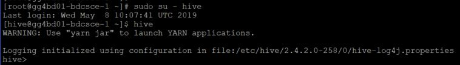
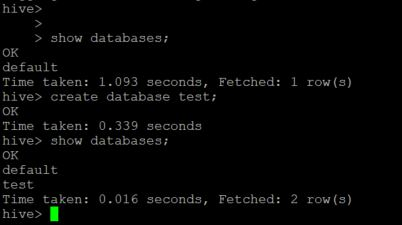
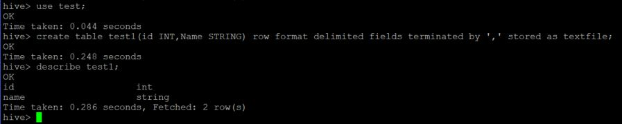
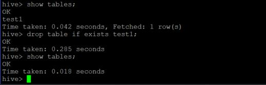
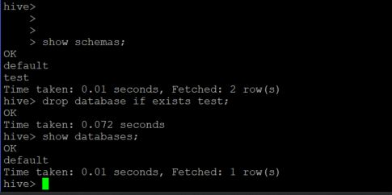
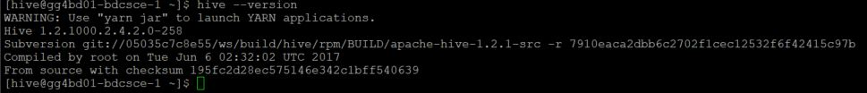

# Lab 300 -  Using BigData Components
(Hadoop, Hive, Pig, Spark, Oracle R)

## Before You Begin

### Introduction
Provision Golden Gate for Big Data simplifies your data integration by working with on-premises and cloud data source/targetss and accepting data in any shape or format. This lab will guide you on how to provision an instance of DIPC

### Objectives
- Provision Provision Golden Gate for Big Data 

### Time to Complete
Approximately 30 minutes

### What Do You Need?
Your will need:
- Oracle Cloud URL
- Oracle Cloud User and Password

### Section 1 - HIVE
This section describes basic administration Commands for HIVE. Apache Hive is a data warehouse system for data summarization, analysis and querying of large data systems in open source Hadoop platform. Hive is a data warehousing package/infrastructure built on top of Hadoop.

#1. Login to Hive Console:

From the Root Console, give the following command :
sudo su - hive

It will give you the details about hive-log4j properties location and will get into hive shell. Please refer the screenshot below:

#2. Database Information:

To list out the databases in HIVE warehouse, enter the following command :
hive> show databases;

To Create a new database, enter the following command :
hive> Create database test;

#3. Table Creation & Deletion:

In order to create a new table in a specific database, you first need to navigate to that database, Use the below commands:
hive>use test;

hive>create table test1(id INT, Name String) row format delimited fields terminated by ',' stored as textfile;

hive> describe test1;

In order to drop table, just use the following simple command:
hive> show tables;

hive> drop table if exists test1;

hive> Show tables;

When you executre show tables first time, you will see test1 listed. Once you drop it and list tables again, it will not be their. Please refer the screenshot below:

#4. Schemas and Databases:

In hove, Schemas and Databases resolve to the same thing, you can either use Schemas or databases, Use the below commands:
hive> Show schemas;

Now we will drop a database name test

hive> drop database if exists test;

hive> show databases;

Please refer the below screenshot:

#5. Version Details:

You can check the details of Hive version with a very simple command. This command has to be executed outside hive shell.

] hive --version
This command will give you Hive version as well as subversion, Please refer to below screenshot.

