# Lab 300 -  Using BigData Components
(Hadoop, Hive, Pig, Spark, Oracle R)

## Before You Begin

### Introduction
Provision Golden Gate for Big Data simplifies your data integration by working with on-premises and cloud data source/targetss and accepting data in any shape or format. This lab will give you basic understanding about various Big data Products.

### Objectives
- Overview about different Golden Gate big data Products. 

### Time to Complete
Approximately 30 minutes

### What Do You Need?
Your will need:
- Access to Big Data Enviornment using Putty

### Section 1 - HIVE
This section describes basic administration Commands for HIVE. Apache Hive is a data warehouse system for data summarization, analysis and querying of large data systems in open source Hadoop platform. Hive is a data warehousing package/infrastructure built on top of Hadoop.

### 1. Login to Hive Console:

From the Root Console, give the following command :
sudo su - hive

It will give you the details about hive-log4j properties location and will get into hive shell. Please refer the screenshot below:

### 2. Database Information:

To list out the databases in HIVE warehouse, enter the following command :
hive> show databases;

To Create a new database, enter the following command :
hive> Create database test;

### 3. Table Creation & Deletion:

In order to create a new table in a specific database, you first need to navigate to that database, Use the below commands:
hive>use test;

hive>create table test1(id INT, Name String) row format delimited fields terminated by ',' stored as textfile;

hive> describe test1;

In order to drop table, just use the following simple command:
hive> show tables;

hive> drop table if exists test1;

hive> Show tables;

When you executre show tables first time, you will see test1 listed. Once you drop it and list tables again, it will not be their. Please refer the screenshot below:

### 4. Schemas and Databases:

In hove, Schemas and Databases resolve to the same thing, you can either use Schemas or databases, Use the below commands:
hive> Show schemas;

Now we will drop a database name test

hive> drop database if exists test;

hive> show databases;

Please refer the below screenshot:

### 5. Version Details:

You can check the details of Hive version with a very simple command. This command has to be executed outside hive shell.

] hive --version
This command will give you Hive version as well as subversion, Please refer to below screenshot.

### SECTION 2 - PIG 

Pig is a high level scripting language that is used with Apache Hadoop. Pig enables data workers to write complex data transformations without knowing Java. Apache Pig is a platform for analyzing large data sets that consists of a high-level language for expressing data analysis programs, coupled with infrastructure for evaluating these programs

### 1. Login to Pig Console:

From the Root Console, Just type 'Pig' and you will get into grunt console.

Root] pig

It will list down various classes under Pig. Please refer the screenshot below.

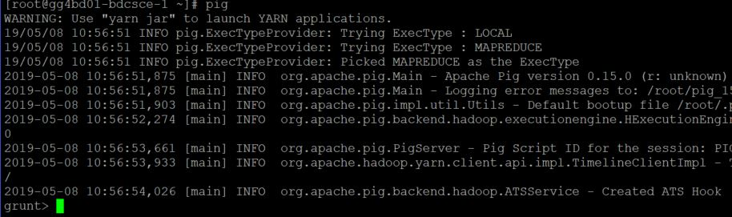

### 2. Pig Version:

You can see the details of the Version of Pig as you go into the grunt console. It also has a dedicated command to check it

Root] pig -version

Please refer the screenshot below:

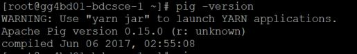

### 3. Data Load:

You can load data from any file to pig relation using the LOAD Command. File can be loaded from hdfs, depending upon the Pig Start up mode.

example : emp= load 'user/file1' as (id:int,name:chararray,sal:int,sex:chararry,dno:int);

You can also list the previously used commands by using History command. Please see below

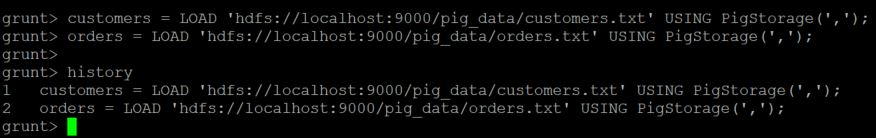

In this example, Data from customer.txt and orders.txt is getting loaded into Customers and Orders respectively.

### 4. Script Execution:

You can execute any pig commands by putting them in a .pig file and running the file at Pig shell. Please see the command below:

grunt> run sample_script.pig

In this example, sample_script contains a LOAD command which is loading into an available pig relation. Please refer the screenshot below:

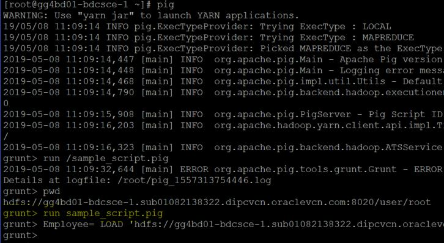

### 5. Listing files:

You can simply list the available files under a file system in the grunt console, Please see the command below:

grunt>sh ls

In  this example, there are some log files created after runnung sample_script.pig, Please refer the screenshot below:

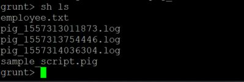

Just Use the quit command to come out of the grunt shell.

grunt> quit

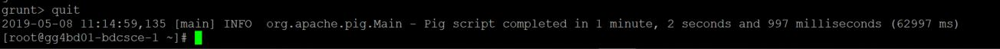

### SECTION 3 - R

R is an integrated suite of software facilities for data manipulation, calculation and graphical display.  Among other things it has :

• An effective data handling and storage facility.

• A suite of operators for calculations on arrays, in particular matrices,

• A large, coherent, integrated collection of intermediate tools for data analysis,

• Graphical facilities for data analysis and display either directly at the computer or on hard-copy

• A  well  developed,  simple  and  effective  programming  language  (called  ‘S’)  which  includes conditionals, loops, user defined recursive functions and input and output facilities.  (Indeed most of the system supplied functions are themselves written in the S language)

### 1. Using R Interactively

When you use the R program it issues a prompt when it expects input commands.  The default prompt is ‘>’, which on UNIX might be the same as the shell prompt.

Create a separate sub-directory,  say work,  to hold data files on which you will use R.  This will be the working directory whenever you use R.

$ mkdir work

$ cd work

Start the R program with the command
$ R

Please refer the screenshot below :

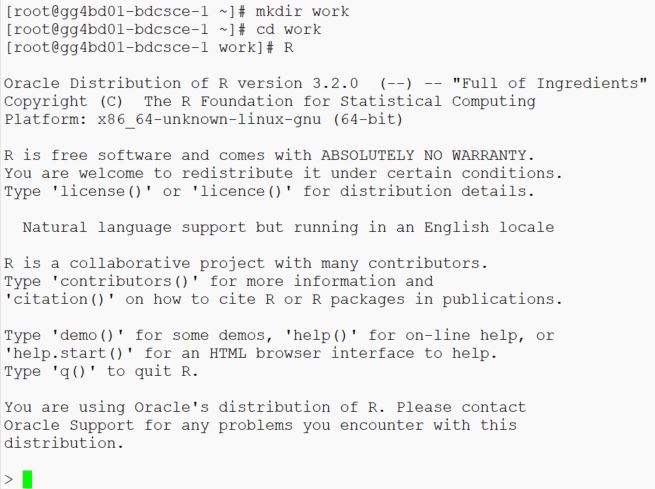

You can use help(solve) which is R's inbuilt help facility similar to man facility of UNIX.  Check the screenshot below on how to run the command.

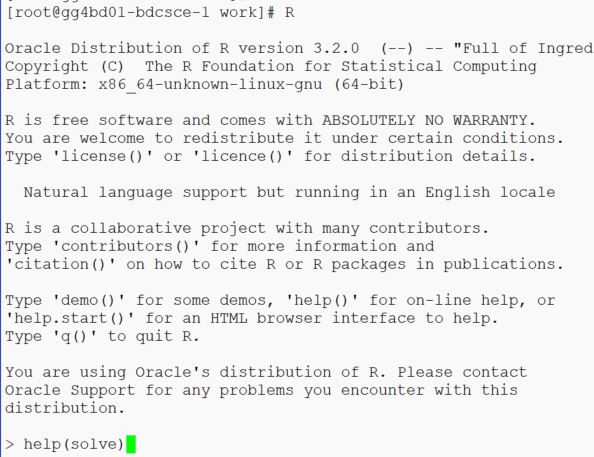

### 2. Simple manipulations; numbers and vectors

R operates on named data structures. simplest such structure is the numeric vector. Consider the following commands to setup values in various vectors:

x <- c(10.4, 5.6, 3.1, 6.4, 21.7)

 y <- c(x, 0, x)

 v <- 2*x + y + 1

 Check the below screenshot for running these commands in R:

 

 During a R session, objects are created and stored by name. You can use the R command objects() or ls() to list the objects in the current R workspace. Please see the screenshot below :

 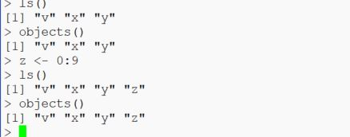

Consider an example of the plot() function. It will display graphically the output, please refer the screenshot below:

d <- outer(0:9, 0:9)

fr <- table(outer(d, d, "-"))

plot(fr, xlab="Determinant", ylab="Frequency")

Plot() uses a histogram like plot method.

 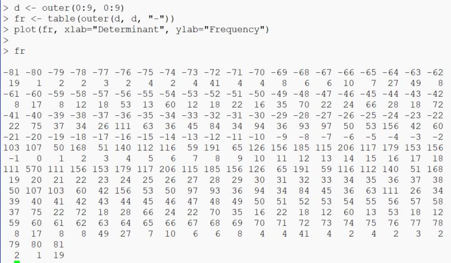

### 3. Files and Directories :

There are many functions to manipulate files and directories. 

* To create an empty file or directory use file.create or dir.create.

* Files can be removed by either file.remove or unlink command.  

* If you want to list the files or directories, you can use list.files or list.dirs. 

Please refer the below screenshot for running these commands on R prompt.

 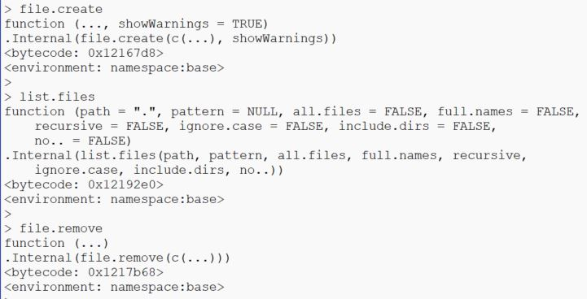