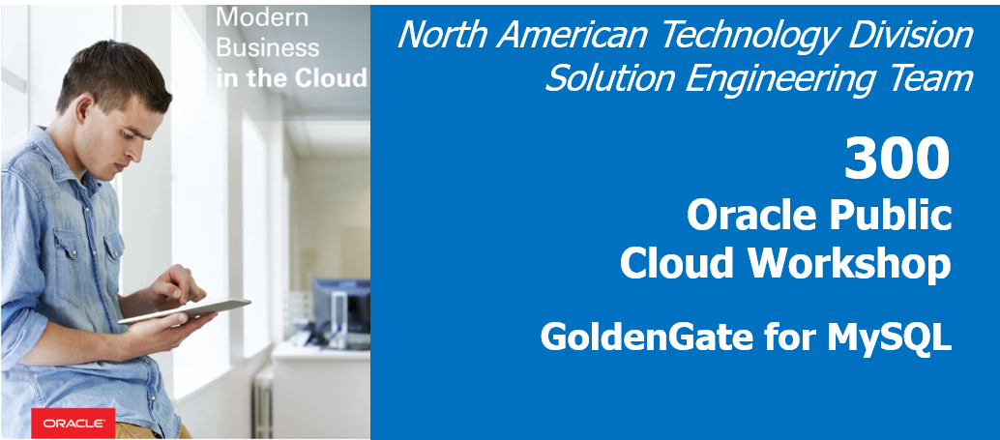

# Lab 400 -  MySQL to MySQL



## Before You Begin

### Introduction
In this lab we will use goldengate for MySQL to capture data from MySQL

### Objectives
- Goldengate replication for MySQL to capture CDC from MySQL

### Time to Complete
Approximately 60 minutes

### What Do You Need?
Your will need:

-Oracle Goldengate for MySQL
-MySQL database.


### STEP 1: Setting up the Environment For MySQL.
    
In this step we will configuring the environment,which is done by editing ASCII files and running OS utilitiesMySQL.  

1. Edit the MySQL server configuration file,which is exist at /etc/my.cnf.

```
datadir=/var/lib/mysql
socket=/var/lib/mysql/mysql.sock
log-error=/var/log/mysqld.log
pid-file=/var/run/mysqld/mysqld.pid
default_authentication_plugin=mysql_native_password
```

### STEP 2: Goldengate Replicat Setup for base extract and pump for all the labs and .

1. Configuring the Primary Extract .

```
[oracle@gg4dbd-source01 ~]$ cd /u01/app/oracle/product/18.1.0_GGMySQL
[oracle@gg4dbd-source01 18.1.0_GGMySQL]$ ./ggsci

Oracle GoldenGate Command Interpreter for MySQL
Version 18.1.0.0.0 OGGCORE_18.1.0.0.0_PLATFORMS_180928.0432
Linux, x64, 64bit (optimized), MySQL Enterprise on Sep 28 2018 19:34:16
Operating system character set identified as UTF-8.

Copyright (C) 1995, 2018, Oracle and/or its affiliates. All rights reserved.


GGSCI (gg4dbd-source01) 1> ADD EXTRACT E_MYSQL, TRANLOG, BEGIN NOW
EXTRACT added.

GGSCI (gg4dbd-source01) 2> edit param E_MYSQL
```

Add the below parameters in the parameter file :
```
EXTRACT E_MYSQL
--------------------------------------------------------------------------
-- ADD EXTRACT E_MYSQL, TRANLOG, BEGIN NOW
-- ADD EXTTRAIL ./dirdat/ea, EXTRACT E_MYSQL
--------------------------------------------------------------------------
SETENV (MYSQL_HOME='/var/lib/mysql')
SETENV (MYSQL_UNIX_PORT='/var/lib/mysql/mysql.sock')
GETENV (MYSQL_HOME)
GETENV (MYSQL_TCP_PORT)
GETENV (MYSQL_UNIX_PORT)
sourcedb employees,userid ggbd,password W3lcome_123#
reportcount every 60 seconds, rate
EXTTRAIL ./dirdat/ea
TRANLOGOPTIONS ALTLOGDEST "/var/lib/mysql/binlog.index"
--TRANLOGOPTIONS ALTLOGDEST REMOTE
GETTRUNCATES;
TABLE employees.employees;
TABLE employees.departments;
TABLE employees.dept_manager;
TABLE employees.dept_emp;
TABLE employees.titles;
TABLE employees.salaries;

```

3. Start the Primary Extract E_MYSQL.

```
GGSCI (gg4dbd-source01) 3> start E_MYSQL

Sending START request to MANAGER ...
EXTRACT E_MYSQL starting


GGSCI (gg4dbd-source01) 4> info all

Program     Status      Group       Lag at Chkpt  Time Since Chkpt

MANAGER     RUNNING
EXTRACT     RUNNING     E_MYSQL     00:00:00      00:00:03

```

4. Configuring the Secondary Extract (PUMP).

```
[oracle@gg4dbd-source01 ~]$ cd /u01/app/oracle/product/18.1.0_GGMySQL
[oracle@gg4dbd-source01 18.1.0_GGMySQL]$ ./ggsci

Oracle GoldenGate Command Interpreter for MySQL
Version 18.1.0.0.0 OGGCORE_18.1.0.0.0_PLATFORMS_180928.0432
Linux, x64, 64bit (optimized), MySQL Enterprise on Sep 28 2018 19:34:16
Operating system character set identified as UTF-8.

Copyright (C) 1995, 2018, Oracle and/or its affiliates. All rights reserved.


GGSCI (gg4dbd-source01) 1> ADD EXTRACT P_MYSQL, EXTTRAILSOURCE ./dirdat/ea
EXTRACT added.


GGSCI (gg4dbd-source01) 2> ADD RMTTRAIL /tmp/ggbd_home1/dirdat/ac, EXTRACT P_MYSQL
RMTTRAIL added.

GGSCI (gg4dbd-source01) 2> edit param P_MYSQL
```
Add the below parameters in the parameter file :
```
EXTRACT P_MYSQL
--------------------------------------------------------------------------
-- ADD EXTRACT P_MYSQL, EXTTRAILSOURCE ./dirdat/ea
-- ADD RMTTRAIL /tmp/ggbd_home1/dirdat/ac, EXTRACT P_MYSQL
--------------------------------------------------------------------------
--RMTHOST 132.145.181.107, MGRPORT 7100
--RMTTRAIL /u01/app/ggbd_home1/dirdat/eb
RMTHOST 129.213.49.56, MGRPORT 7100
RMTTRAIL /tmp/ggbd_home1/dirdat/ac
PASSTHRU
REPORTCOUNT EVERY 60 SECONDS, RATE

TABLE employees.*;

```

3. Start the Secondary Extract P_MYSQL.

```
GGSCI (gg4dbd-source01) 3> start P_MYSQL

Sending START request to MANAGER ...
EXTRACT P_MYSQL starting


GGSCI (gg4dbd-source01) 4> info all

Program     Status      Group       Lag at Chkpt  Time Since Chkpt

MANAGER     RUNNING
EXTRACT     RUNNING     E_MYSQL     00:00:00      00:00:04
EXTRACT     RUNNING     P_MYSQL     00:00:00      00:00:02

```

You have completed lab 400! Great Job!


