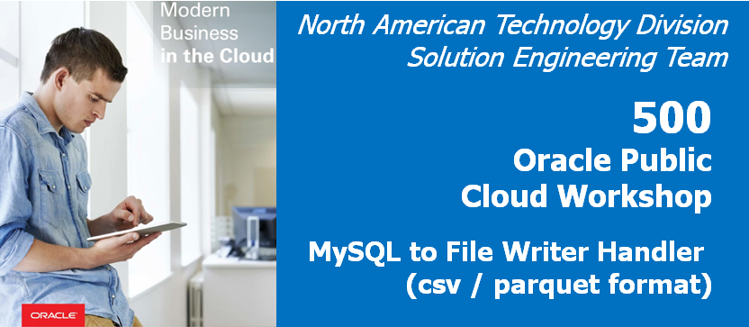
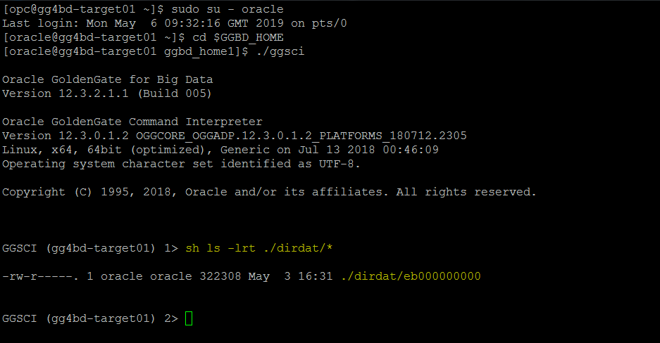
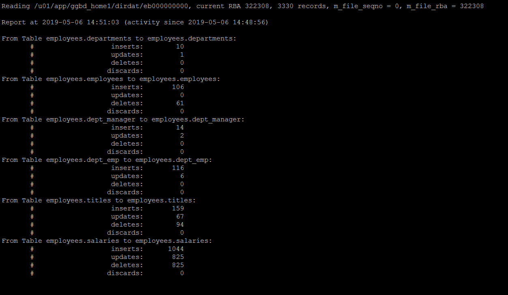
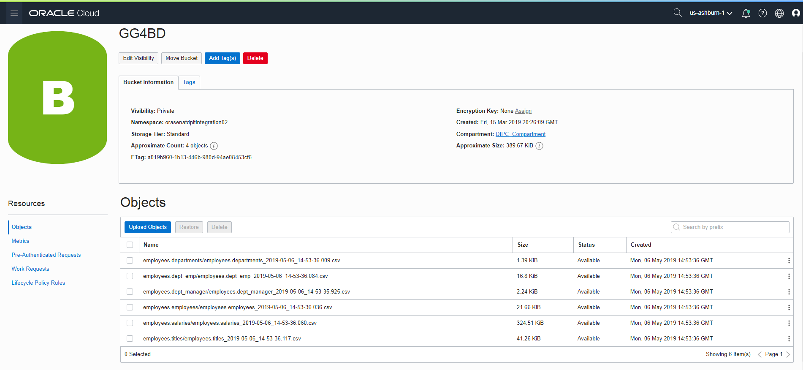
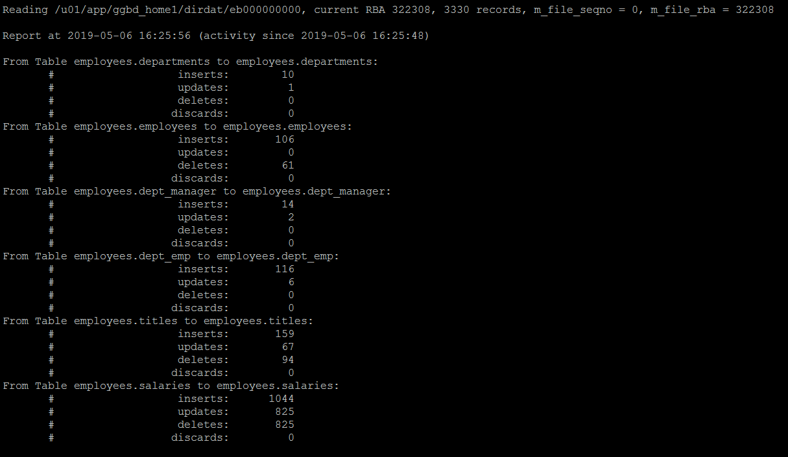
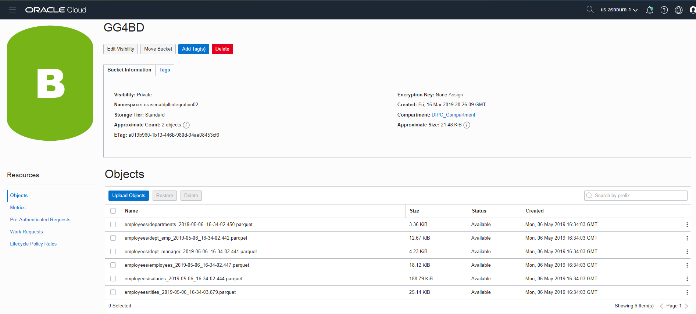

# Lab 500 -  MySQL to File Writer Handler (csv / parquet format)



## Before You Begin

### Introduction
In this lab we will use goldengate for bigdata file writer handler to replicate data into OCI cloud in delimitedtext and parquet format.

### Objectives
- Goldengate BigData replication to OCI Object Storage in dsv and parquet format

### Time to Complete
Approximately 60 minutes

### What Do You Need?
Your will need:
- Goldengate for Bigdata
- Oracle Cloud Object Storage Connection Detals and Library files.
- for parquet format , need parquet libraries

### STEP 1: Setting up the Environment For Connection to OCI Cloud.
    
In this step we will set up the compute instace to be able to connect to OCI cloud. We need to Download the OCI libraries and keep it in a directory. 

1. We will create a directory oci and keep the file here.

```
[opc@gg4bd-target01 ~]$ sudo su - oracle
Last login: Mon May  6 09:22:44 GMT 2019 on pts/0
[oracle@gg4bd-target01 ~]$ mkdir  ~/.oci
```

2. Create config file with OCI Cloud connection details like User , fingerprint, region. You can get these details from your instructor.

```
[oracle@gg4bd-target01 Downloads]$ cd
[oracle@gg4bd-target01 ~]$ clear
[oracle@gg4bd-target01 ~]$ cd ~/.oci
[oracle@gg4bd-target01 .oci]$ vi config
```

And add the below details in the file
```
[DEFAULT]
user=ocid1.user.oc1..aaaaaaaaqpcwz5cgjseweox6cyiikgxlgeypxuqlu7xlvxndp2frejmpzmaa
fingerprint=73:71:47:43:ba:87:1a:7d:ac:f8:a9:c1:62:8b:1a:58
region=us-ashburn-1
key_file=/home/oracle/.oci/oci_api_key.pem
tenancy=ocid1.tenancy.oc1..aaaaaaaa7l6wfqydzz6otbjnhrloxf4tezittufwjlwbaoxvajvkr6hyxmba
```

3. Now Copy the .pem file from /home/oracle/Downloads to ~/.oci directory. If this is not available in this location then get it from your instructor.

```
[oracle@gg4bd-target01 .oci]$ cp /home/oracle/Downloads/oci_api_key.pem ~/.oci
[oracle@gg4bd-target01 .oci]$ ls -lrt
total 8
-rw-rw-r--. 1 oracle oracle  304 May  6 09:39 config
-rw-rw-r--. 1 oracle oracle 1680 May  6 09:42 oci_api_key.pem
[oracle@gg4bd-target01 .oci]$
```

4. We need to unzip and keep the OCI java sdk file in a location which are needed for replicat to connect. 

In our environment we have it downloaded in /home/oracle/Downloads. So Will create a directory for jars and copy the file into that directory.

```
[oracle@gg4bd-target01 ggbd_home1]$ mkdir -p /u01/app/jars/oci_libs
[oracle@gg4bd-target01 ggbd_home1]$ cp /home/oracle/Downloads/oci-sdk.tar /u01/app/jars/oci_libs/
```

Now untar the file in the location.

```
[oracle@gg4bd-target01 ggbd_home1]$ cd /u01/app/jars/oci_libs/
[oracle@gg4bd-target01 ggbd_home1]$ tar -xvf oci-sdk.tar

```

### STEP 2: Goldengate Replicat Setup for delimitedtext format in OCI Obejct Storage.

1. We already have a trail file created in the GGBD home. We will be using the same trail file to replicate to OCI Object Storage.




2. Add the replicat with the below commands.

```
GGSCI (gg4bd-target01) 4> add replicat RFWDSV, exttrail ./dirdat/eb
REPLICAT added.

GGSCI (gg4bd-target01) 5> edit param RFWDSV
```

Add the below parameters in the parameter file :
```
REPLICAT RFWDSV
-----------------------------------------------------------------------------------------
-- Trail file for this example is located in "AdapterExamples/trail" directory
-- Command to add REPLICAT
-- add replicat RFWDSV, exttrail ./dirdat/eb
-- SETENV(GGS_JAVAUSEREXIT_CONF = 'dirprm/fw.props')
-----------------------------------------------------------------------------------------
TARGETDB LIBFILE libggjava.so SET property=dirprm/rfwdsv.props
REPORTCOUNT EVERY 1 MINUTES, RATE
GROUPTRANSOPS 1000
MAP employees.*, TARGET employees.*;
```

3. Now edit the dirprm/rfwdsv.props file with the below parameters. You can use sample property files found in $GGBD_HOME/AdapterExamples/big-data/filewriter .

```
GGSCI (gg4bd-target01) 8> exit
[oracle@gg4bd-target01 ggbd_home1]$ cd dirprm
[oracle@gg4bd-target01 dirprm]$ vi rfwdsv.props
```

Below are the parametrs we will be using.

```
gg.handlerlist=filewriter

#The File Writer Handler
gg.handler.filewriter.type=filewriter
gg.handler.filewriter.mode=op
gg.handler.filewriter.pathMappingTemplate=./dirout
gg.handler.filewriter.stateFileDirectory=./dirsta
gg.handler.filewriter.fileNameMappingTemplate=${fullyQualifiedTableName}_${currentTimestamp}.txt
gg.handler.filewriter.fileRollInterval=7m
gg.handler.filewriter.finalizeAction=delete
gg.handler.filewriter.inactivityRollInterval=7m
gg.handler.filewriter.format=delimitedtext
gg.handler.filewriter.format.pkUpdateHandling=update
gg.handler.filewriter.partitionByTable=true
gg.handler.filewriter.includetokens=true
gg.handler.filewriter.partitionByTable=true
#Selecting the Parquet Event Handler
gg.handler.filewriter.eventHandler=oci
gg.handler.filewriter.rollOnShutdown=true

#The OCI Event handler
gg.eventhandler.oci.type=oci
gg.eventhandler.oci.configFilePath=~/.oci/config
gg.eventhandler.oci.profile=DEFAULT
gg.eventhandler.oci.namespace=orasenatdpltintegration02
gg.eventhandler.oci.region=us-ashburn-1
gg.eventhandler.oci.compartmentID=ocid1.compartment.oc1..aaaaaaaanunsv7u5me5gn3mcq6xlyknaebaj7uxaf42rzpo37xhfrjgqokaq
gg.eventhandler.oci.pathMappingTemplate=${fullyQualifiedTableName}
gg.eventhandler.oci.bucketMappingTemplate=GG4BD
gg.eventhandler.oci.fileNameMappingTemplate=${fullyQualifiedTableName}_${currentTimestamp}.csv
gg.eventhandler.oci.finalizeAction=NONE

goldengate.userexit.timestamp=utc
goldengate.userexit.writers=javawriter
javawriter.stats.display=TRUE
javawriter.stats.full=TRUE

gg.log=log4j
gg.log.level=INFO
gg.includeggtokens=true
gg.report.time=30sec

#Set the classpath here
#User TODO - Need the AWS Java SDK, Parquet Dependencies, HDFS Client Dependencies
gg.classpath=/u01/app/jars/oci_libs/oci/lib/*:/u01/app/jars/oci_libs/oci/third-party/lib/*
javawriter.bootoptions=-Xmx512m -Xms32m -Djava.class.path=.:ggjava/ggjava.jar:./dirprm
```

4. Now goto ggsci prompt and you will see the replicat RFWDSV. start the replicat and see the data in the OCI object storage.



5. You will be able to see the files created in OCI object storage.



### STEP 3: Goldengate Replicat Setup for parquet format in OCI Obejct Storage.

1. For parquet format we need parquet jars. We have the parquet jars downloaded in /home/oracle/Downloads. copy these jars in a directory and unzip them

```
[oracle@gg4bd-target01 jars]$ pwd
/u01/app/jars
[oracle@gg4bd-target01 jars]$ mkdir parquet_libs
[oracle@gg4bd-target01 jars]$ ls -lrt
total 8
drwxrwxr-x. 3 oracle oracle 4096 May  6 14:45 oci_libs
drwxrwxr-x. 2 oracle oracle 4096 May  6 15:36 parquet_libs
```

```
[oracle@gg4bd-target01 jars]$ cd parquet_libs
[oracle@gg4bd-target01 jars]$ cp /home/oracle/Downloads/parquet-hadoop-2.5.zip /u01/app/jars/parquet_libs/
[oracle@gg4bd-target01 jars]$ cp /home/oracle/Downloads/parquet_libs.zip /u01/app/jars/parquet_libs/

[oracle@gg4bd-target01 parquet_libs]$ ls -lrt
total 57440
-rwxr-xr-x. 1 oracle oracle 36967765 May  6 15:38 parquet-hadoop-2.5.zip
-rwxr-xr-x. 1 oracle oracle 21847689 May  6 15:38 parquet_libs.zip

[oracle@gg4bd-target01 parquet_libs]$ unzip parquet_libs.zip
[oracle@gg4bd-target01 parquet_libs]$ unzip parquet-hadoop-2.5.zip
```

2. Add the replicat with the below command

```
GGSCI (gg4bd-target01) 49> add replicat rfwprq, exttrail ./dirdat/eb
REPLICAT added.

GGSCI (gg4bd-target01) 50> edit param rfwprq
```

Add the below parameters in the parameter file :

```
REPLICAT RFWPRQ
-----------------------------------------------------------------------------------------
-- Trail file for this example is located in "AdapterExamples/trail" directory
-- Command to add REPLICAT
-- add replicat RFWPRQ, exttrail ./dirdat/eb
-- SETENV(GGS_JAVAUSEREXIT_CONF = 'dirprm/fw.props')
-----------------------------------------------------------------------------------------
TARGETDB LIBFILE libggjava.so SET property=dirprm/rfwprq.props
REPORTCOUNT EVERY 1 MINUTES, RATE
GROUPTRANSOPS 1000
MAP employees.*, TARGET employees.*;
```
3. Now edit the dirprm/rfwprq.props file with the below parameters. You can use sample property files found in $GGBD_HOME/AdapterExamples/big-data/filewriter .

```
GGSCI (gg4bd-target01) 1> exit
[oracle@gg4bd-target01 ggbd_home1]$ cd dirprm
[oracle@gg4bd-target01 dirprm]$ vi rfwprq.props
```
Below are the parametrs we will be using.

```
gg.handlerlist=filewriter

#The File Writer Handler
gg.handler.filewriter.type=filewriter
gg.handler.filewriter.mode=op
gg.handler.filewriter.pathMappingTemplate=./dirout
gg.handler.filewriter.stateFileDirectory=./dirsta
gg.handler.filewriter.fileNameMappingTemplate=${fullyQualifiedTableName}_${currentTimestamp}.txt
gg.handler.filewriter.fileRollInterval=7m
gg.handler.filewriter.finalizeAction=delete
gg.handler.filewriter.inactivityRollInterval=7m
gg.handler.filewriter.format=avro_row_ocf
gg.handler.filewriter.format.pkUpdateHandling=update
gg.handler.filewriter.includetokens=true
gg.handler.filewriter.partitionByTable=true
#Selecting the Parquet Event Handler
gg.handler.filewriter.eventHandler=parquet
gg.handler.filewriter.rollOnShutdown=true

#The Parquet Event Handler
gg.eventhandler.parquet.type=parquet
gg.eventhandler.parquet.pathMappingTemplate=./dirparquet
gg.eventhandler.parquet.writeToHDFS=false
gg.eventhandler.parquet.finalizeAction=delete
#Selecting the S3 Event Handler
gg.eventhandler.parquet.eventHandler=oci
gg.eventhandler.parquet.fileNameMappingTemplate=${tableName}_${currentTimestamp}.parquet

#The OCI Event handler
gg.eventhandler.oci.type=oci
gg.eventhandler.oci.configFilePath=~/.oci/config
gg.eventhandler.oci.profile=DEFAULT
gg.eventhandler.oci.namespace=orasenatdpltintegration02
gg.eventhandler.oci.region=us-ashburn-1
gg.eventhandler.oci.compartmentID=ocid1.compartment.oc1..aaaaaaaanunsv7u5me5gn3mcq6xlyknaebaj7uxaf42rzpo37xhfrjgqokaq
gg.eventhandler.oci.pathMappingTemplate=${schemaName}
gg.eventhandler.oci.bucketMappingTemplate=GG4BD
gg.eventhandler.oci.fileNameMappingTemplate=${tableName}_${currentTimestamp}.parquet
gg.eventhandler.oci.finalizeAction=NONE

goldengate.userexit.timestamp=utc
goldengate.userexit.writers=javawriter
javawriter.stats.display=TRUE
javawriter.stats.full=TRUE

gg.log=log4j
gg.log.level=INFO
gg.includeggtokens=true
gg.report.time=30sec

#Set the classpath here
#User TODO - Need the AWS Java SDK, Parquet Dependencies, HDFS Client Dependencies
gg.classpath=/u01/app/jars/oci_libs/oci/lib/*:/u01/app/jars/oci_libs/oci/third-party/lib/*:/u01/app/jars/parquet_libs/*

javawriter.bootoptions=-Xmx512m -Xms32m -Djava.class.path=.:ggjava/ggjava.jar:./dirprm
```
4. Now you can goto ggsci command prompt and start the replicat RFWPRQ.



5. You will be able to see the files created in OCI object storage.

