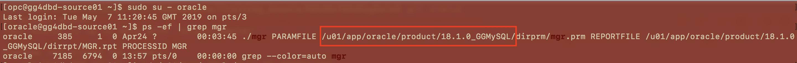
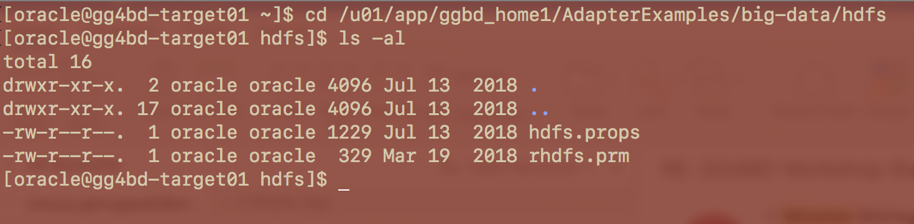
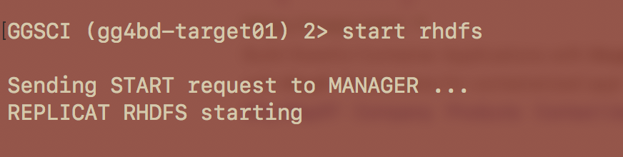
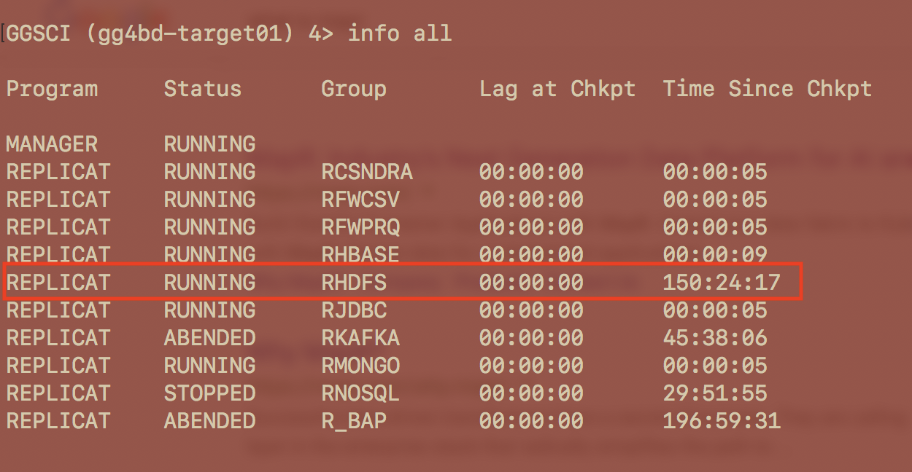

# Lab 600 -  MySQL to HDFS (json text format)


## Before You Begin

### Introduction
In this lab, we will see how to replicate data from MySQL to HDFS using GoldenGate for Big Data.

### Objectives
- GoldenGate replication from MySQL to HDFS

### Time to Complete
Approximately 30 minutes

### What Do You Need?
Your will need:
- Oracle Cloud URL
- Oracle Cloud User and Password
- Installed GoldenGate for MySQL on the source instance where MySQL is running
- Installed GoldenGate for Big Data on the target instance where HDFS is installed

## MySQL Source Configuration
### STEP 1: Log in to your Oracle Cloud console and find the public IP address of the source instance. Open a terminal or a Putty and ssh into that source instance with the following command:
```
$ ssh -i <path_to_private_key> opc@<public_IP_address>
```

### STEP 2: Check where GoldenGate `mgr` process is running.
1. Change to `oracle` user
    ```
    $ sudo su - oracle
    ```
2. Search for the process `mgr`
    ```
    $ ps -ef | grep mgr
    ```
3. You see that `mgr` is running and GoldenGate for MySQL is installed in the location `/u01/app/oracle/product/18.1.0_GGMySQL`.

    

4. Change directory to the path we found in the previous step.

    ```
    $ cd /u01/app/oracle/product/18.1.0_GGMySQL
    ```
5. Start GGSCI
    ```
    $ ./ggsci
    ```
6. Steps to set up Extract on MySQL
### STEP 3: Setting up the Environment For MySQL.
    
In this step we will configuring the environment,which is done by editing ASCII files and running OS utilitiesMySQL.  

1. Edit the MySQL server configuration file,which is exist at /etc/my.cnf.

```
datadir=/var/lib/mysql
socket=/var/lib/mysql/mysql.sock
log-error=/var/log/mysqld.log
pid-file=/var/run/mysqld/mysqld.pid
default_authentication_plugin=mysql_native_password
```

### STEP 4: Goldengate Replicat Setup for base extract and pump for all the labs and .

1. Configuring the Primary Extract .

```
[oracle@gg4dbd-source01 ~]$ cd /u01/app/oracle/product/18.1.0_GGMySQL
[oracle@gg4dbd-source01 18.1.0_GGMySQL]$ ./ggsci

Oracle GoldenGate Command Interpreter for MySQL
Version 18.1.0.0.0 OGGCORE_18.1.0.0.0_PLATFORMS_180928.0432
Linux, x64, 64bit (optimized), MySQL Enterprise on Sep 28 2018 19:34:16
Operating system character set identified as UTF-8.

Copyright (C) 1995, 2018, Oracle and/or its affiliates. All rights reserved.


GGSCI (gg4dbd-source01) 1> ADD EXTRACT E_MYSQL, TRANLOG, BEGIN NOW
EXTRACT added.

GGSCI (gg4dbd-source01) 2> edit param E_MYSQL
```

Add the below parameters in the parameter file :
```
EXTRACT E_MYSQL
--------------------------------------------------------------------------
-- ADD EXTRACT E_MYSQL, TRANLOG, BEGIN NOW
-- ADD EXTTRAIL ./dirdat/ea, EXTRACT E_MYSQL
--------------------------------------------------------------------------
SETENV (MYSQL_HOME='/var/lib/mysql')
SETENV (MYSQL_UNIX_PORT='/var/lib/mysql/mysql.sock')
GETENV (MYSQL_HOME)
GETENV (MYSQL_TCP_PORT)
GETENV (MYSQL_UNIX_PORT)
sourcedb employees,userid ggbd,password W3lcome_123#
reportcount every 60 seconds, rate
EXTTRAIL ./dirdat/ea
TRANLOGOPTIONS ALTLOGDEST "/var/lib/mysql/binlog.index"
--TRANLOGOPTIONS ALTLOGDEST REMOTE
GETTRUNCATES;
TABLE employees.employees;
TABLE employees.departments;
TABLE employees.dept_manager;
TABLE employees.dept_emp;
TABLE employees.titles;
TABLE employees.salaries;

```

3. Start the Primary Extract E_MYSQL.

```
GGSCI (gg4dbd-source01) 3> start E_MYSQL

Sending START request to MANAGER ...
EXTRACT E_MYSQL starting


GGSCI (gg4dbd-source01) 4> info all

Program     Status      Group       Lag at Chkpt  Time Since Chkpt

MANAGER     RUNNING
EXTRACT     RUNNING     E_MYSQL     00:00:00      00:00:03

```

4. Configuring the Secondary Extract (PUMP).

```
[oracle@gg4dbd-source01 ~]$ cd /u01/app/oracle/product/18.1.0_GGMySQL
[oracle@gg4dbd-source01 18.1.0_GGMySQL]$ ./ggsci

Oracle GoldenGate Command Interpreter for MySQL
Version 18.1.0.0.0 OGGCORE_18.1.0.0.0_PLATFORMS_180928.0432
Linux, x64, 64bit (optimized), MySQL Enterprise on Sep 28 2018 19:34:16
Operating system character set identified as UTF-8.

Copyright (C) 1995, 2018, Oracle and/or its affiliates. All rights reserved.


GGSCI (gg4dbd-source01) 1> ADD EXTRACT P_MYSQL, EXTTRAILSOURCE ./dirdat/ea
EXTRACT added.


GGSCI (gg4dbd-source01) 2> ADD RMTTRAIL /tmp/ggbd_home1/dirdat/ac, EXTRACT P_MYSQL
RMTTRAIL added.

GGSCI (gg4dbd-source01) 2> edit param P_MYSQL
```
Add the below parameters in the parameter file :
```
EXTRACT P_MYSQL
--------------------------------------------------------------------------
-- ADD EXTRACT P_MYSQL, EXTTRAILSOURCE ./dirdat/ea
-- ADD RMTTRAIL /tmp/ggbd_home1/dirdat/ac, EXTRACT P_MYSQL
--------------------------------------------------------------------------
--RMTHOST 132.145.181.107, MGRPORT 7100
--RMTTRAIL /u01/app/ggbd_home1/dirdat/eb
RMTHOST 129.213.49.56, MGRPORT 7100
RMTTRAIL /tmp/ggbd_home1/dirdat/ac
PASSTHRU
REPORTCOUNT EVERY 60 SECONDS, RATE

TABLE employees.*;

```

5. Start the Secondary Extract P_MYSQL.

```
GGSCI (gg4dbd-source01) 3> start P_MYSQL

Sending START request to MANAGER ...
EXTRACT P_MYSQL starting


GGSCI (gg4dbd-source01) 4> info all

Program     Status      Group       Lag at Chkpt  Time Since Chkpt

MANAGER     RUNNING
EXTRACT     RUNNING     E_MYSQL     00:00:00      00:00:04
EXTRACT     RUNNING     P_MYSQL     00:00:00      00:00:02

```
## HDFS Target Configuration
1. Go to `/u01/app/ggbd_home1/AdapterExamples/big-data/hdfs`. You should have 2 files `hdfs.props` and `rhdfs.prm`.
    ```
    $ cd /u01/app/ggbd_home1/AdapterExamples/big-data/hdfs
    $ ls -al
    ```
    

2. Take back up of these files.
    ```
    $ cp hdfs.props hdfs.props_bkp
    $ cp rhdfs.prm rhdfs.prm_bkp
    ```

3. Edit `hdfs.props` file

    ```
    $ vi hdfs.props
    ```
    * Enter the following contents:
    ```
    javawriter.stats.full=TRUE

    gg.log=log4j
    gg.log.level=INFO

    gg.report.time=30sec

    #Sample gg.classpath for Apache Hadoop
    #gg.classpath=/var/lib/hadoop/share/hadoop/common/*:/var/lib/hadoop/share/hadoop/common/lib/*:/var/lib/hadoop/share/hadoop/hdfs/*:/var/lib/hadoop/share/hadoop/hdfs/lib/*:/var/lib/hadoop/etc/hadoop/:

    gg.classpath=ggjava/ggjava.jar:/u01/app/hadoop-2.7.6/etc/hadoop/:/u01/app/hadoop-2.7.6/share/hadoop/common/*:/u01/app/hadoop-2.7.6/share/hadoop/common/lib/*:/u01/app/hadoop-2.7.6/share/hadoop/hdfs/*:/u01/app/hadoop-2.7.6/share/hadoop/hdfs/lib/*:/u01/app/jars/hadoop-hdfs-2.4.0.jar
    #Sample gg.classpath for CDH
    #gg.classpath=/opt/cloudera/parcels/CDH/lib/hadoop/client/*:/etc/hadoop/conf
    #Sample gg.classpath for HDP
    #gg.classpath=/usr/hdp/current/hadoop-client/client/*:/etc/hadoop/conf

    javawriter.bootoptions=-Xmx512m -Xms32m -Djava.class.path=ggjava/ggjava.jar
    ```

    * Save and quit.
4. Edit `rhdfs.prm` file.
    ```
    $ vi rhdfs.prm
    ```

    * Enter the following contents:
    ```
    REPLICAT rhdfs
    ---------------------------------------------------------------------------------------
    -- Trail file for this example is located in "AdapterExamples/trail" directory
    -- Command to add REPLICAT
    -- add replicat rhdfs, exttrail ./dirdat/eb
    ---------------------------------------------------------------------------------------
    TARGETDB LIBFILE libggjava.so SET property=dirprm/hdfs.props
    REPORTCOUNT EVERY 1 MINUTES, RATE
    GROUPTRANSOPS 10000
    MAP employees.*, TARGET employees.*;
    ```

    * Save and quit.

5. Move these files to `/u01/app/ggbd_home1/dirprm` directory.
    ```
    $ mv /u01/app/ggbd_home1/AdapterExamples/big-data/hdfs/* /u01/app/ggbd_home1/dirprm
    ```

6. Add and start replicat `rhdfs`.
    ```
    [oracle@gg4bd-target01 ggbd_home1]$ cd /u01/app/ggbd_home1
    [oracle@gg4bd-target01 ggbd_home1]$ ./ggsci
    GGSCI (gg4bd-target01) 1> add replicat rhdfs, exttrail ./dirdat/eb
    GGSCI (gg4bd-target01) 2> start rhdfs
    GGSCI (gg4bd-target01) 3> info all
    ```
    
    

7. Once the replicat is started and running, everything is ready for replication. To see the statistics of the data being replicated, issue the following command in `./ggsci`:

    ```
    GGSCI (gg4bd-target01) 4> send rhdfs stats

    Sending STATS request to REPLICAT RHDFS ...

    Start of Statistics at 2019-05-07 15:30:23.

    Replicating from employees.departments to employees.departments:

    *** Total statistics since 2019-05-07 15:30:19 ***
        Total inserts                                     10.00
        Total updates                                      1.00
        Total deletes                                      0.00
        Total discards                                     0.00
        Total operations                                  11.00

    *** Daily statistics since 2019-05-07 15:30:19 ***
        Total inserts                                     10.00
        Total updates                                      1.00
        Total deletes                                      0.00
        Total discards                                     0.00
        Total operations                                  11.00

    *** Hourly statistics since 2019-05-07 15:30:19 ***
        Total inserts                                     10.00
        Total updates                                      1.00
        Total deletes                                      0.00
        Total discards                                     0.00
        Total operations                                  11.00

    *** Latest statistics since 2019-05-07 15:30:19 ***
        Total inserts                                     10.00
        Total updates                                      1.00
        Total deletes                                      0.00
        Total discards                                     0.00
        Total operations                                  11.00
    ```
Congratulations, you have finished lab 600!
    


