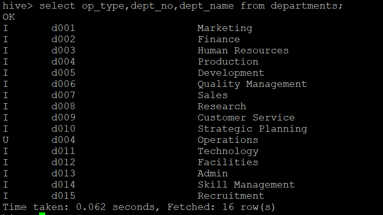

# Lab 700 -  MySQL to Hive


## Before You Begin

### Introduction
In this lab we will use goldengate for bigdata, which can replicate source transactional data to Hive. The Oracle GoldenGate for Big Data Handler allows you to populate data to Hive tables from existing Oracle GoldenGate supported sources.

### Objectives
- Replicate source transactional data to Hive using Oracle Goldengate for Bigdata.

### Time to Complete
Approximately 60 minutes

### What Do You Need?
Your will need:
- Goldengate for Bigdata

### STEP 1: Setting up the Environment For Connection to MySQL Database using Goldengate.
    
In this step we will set up the compute instace to be able to connect to MySQL  database using Goldengate Extract.

1. Logon to Goldengate command prompt for MySQL.

```
[oracle@gg4dbd-source01 18.1.0_GGMySQL]$ ./ggsci

Oracle GoldenGate Command Interpreter for MySQL
Version 18.1.0.0.0 OGGCORE_18.1.0.0.0_PLATFORMS_180928.0432
Linux, x64, 64bit (optimized), MySQL Enterprise on Sep 28 2018 19:34:16
Operating system character set identified as UTF-8.

Copyright (C) 1995, 2018, Oracle and/or its affiliates. All rights reserved.


GGSCI (gg4dbd-source01) 1>
```

2. Create a new extract "E_MYSQL" to connect to MySQL database.

```
GGSCI (gg4dbd-source01) 2> ADD EXTRACT E_MYSQL, TRANLOG, BEGIN NOW
```

3. Once the extract is created, create an exttrail for the extract

```
GGSCI (gg4dbd-source01) 3> ADD EXTTRAIL ./dirdat/ea, EXTRACT E_MYSQL
```

3. Include the below parameters in the Extract parameter file.

```
GGSCI (gg4dbd-source01) 3> EDIT PARAMS E_MYSQL
```

```
EXTRACT E_MYSQL
--------------------------------------------------------------------------
-- ADD EXTRACT E_MYSQL, TRANLOG, BEGIN NOW
-- ADD EXTTRAIL ./dirdat/ea, EXTRACT E_MYSQL
--------------------------------------------------------------------------
SETENV (MYSQL_HOME='/var/lib/mysql')
SETENV (MYSQL_UNIX_PORT='/var/lib/mysql/mysql.sock')
GETENV (MYSQL_HOME)
GETENV (MYSQL_TCP_PORT)
GETENV (MYSQL_UNIX_PORT)
sourcedb employees,userid ggbd,password W3lcome_123#
reportcount every 60 seconds, rate
EXTTRAIL ./dirdat/ea
TRANLOGOPTIONS ALTLOGDEST "/var/lib/mysql/binlog.index"
GETTRUNCATES;
TABLE employees.employees;
TABLE employees.departments;
TABLE employees.dept_manager;
TABLE employees.dept_emp;
TABLE employees.titles;
TABLE employees.salaries;
```

4. After adding the parameters in Extract parameter file, start the extract.

```
GGSCI (gg4dbd-source01) 6> START E_MYSQL
```


5. Now, create the pump and remote trail to send data to remote location.

```
GGSCI (gg4dbd-source01) 7> ADD EXTRACT P_MYSQL, EXTTRAILSOURCE ./dirdat/ea
GGSCI (gg4dbd-source01) 8> ADD RMTTRAIL /u01/app/ggbd_home1/dirdat/ac, EXTRACT P_MYSQL
```

6. Edit the pump parameter file.

```
GGSCI (gg4dbd-source01) 10> EDIT PARAM P_MYSQL
```

Below is the sample pump parameter file.

```
EXTRACT P_MYSQL
--------------------------------------------------------------------------
-- ADD EXTRACT P_MYSQL, EXTTRAILSOURCE ./dirdat/ac
-- ADD RMTTRAIL /tmp/ggbd_home1/dirdat/ac, EXTRACT P_MYSQL
--------------------------------------------------------------------------
RMTHOST 129.213.49.56, MGRPORT 7100
RMTTRAIL /tmp/ggbd_home1/dirdat/ac
PASSTHRU
REPORTCOUNT EVERY 60 SECONDS, RATE

TABLE employees.*;
```

7. Start the pump process and check the status of pump.

```
GGSCI (gg4dbd-source01) 11> START P_MYSQL
GGSCI (gg4dbd-source01) 12> INFO ALL
```


Extract and pump is configured for data capture on MySQL.

### STEP 2: Goldengate Replicat Setup for Hive.

1. Trail file ac is sent to /tmp/ggbd_home1/dirdat/ in the GGBD home by pump. We will be using the same trail file to replicate to HIVE.


Please refer to Lab 400 for more information

2. Add the replicat with the below commands.

```
GGSCI (gg4bd-target01) 4> ADD REPLICAT RHIVE, EXTTRAIL ./dirdat/ac
REPLICAT added.

GGSCI (gg4bd-target01) 5> edit param RHIVE
```

Add the below parameters in the parameter file :
```
REPLICAT rhive
--------------------------------------------------------------------------------------------
-- Trail file for this example is located in "AdapterExamples/trail" directory
-- Command to add REPLICAT
-- add replicat rhive, exttrail /tmp/ggbd_home1/dirdat/ac
-- SETENV(GGS_JAVAUSEREXIT_CONF = 'dirprm/fw.props')
--------------------------------------------------------------------------------------------
TARGETDB LIBFILE libggjava.so SET property=dirprm/hive2.props
REPORTCOUNT EVERY 1 MINUTES, RATE
GROUPTRANSOPS 1000

MAP employees.*, TARGET EMPLOYEES.*;
```

3. Now edit the dirprm/hive2.props file with the below parameters. You can use sample property files found in $GGBD_HOME/AdapterExamples/big-data/hdfs. Make sure that hive jdbc URL parameter is defined and, configuration path is included in the "gg.classpath".
hive url, jdbc driver path and configuration path for our lab are given below.

```
gg.handler.hdfs.hiveJdbcUrl=jdbc:hive2://129.213.49.56:1080/default;ssl=true;sslTrustStore=/tmp/bdcsce.jks;trustStorePassword=changeit?hive.server2.transport.mode=http;hive.server2.thrift.http.path=hs2service

gg.handler.hdfs.hiveJdbcDriver=org.apache.hive.jdbc.HiveDriver
gg.handler.hdfs.hiveJdbcUserName=bdcsce_admin
gg.handler.hdfs.hiveJdbcPassword=Wel_Come#123
```

```
GGSCI (gg4bd-target01) 8> exit
[oracle@gg4bd-target01 ggbd_home1]$ cd dirprm
[oracle@gg4bd-target01 dirprm]$ vi hive2.props
```

Below are the parameters we will be using.

```
gg.handlerlist=hdfs

gg.handler.hdfs.type=hdfs
gg.handler.hdfs.includeTokens=false
gg.handler.hdfs.maxFileSize=1g
gg.handler.hdfs.pathMappingTemplate=/apps/hive/warehouse/employees.db/${fullyQualifiedTableName}
gg.handler.hdfs.fileRollInterval=10s
gg.handler.hdfs.inactivityRollInterval=0
gg.handler.hdfs.fileNameMappingTemplate=${fullyQualifiedTableName}_${groupName}_${currentTimestamp}.txt
gg.handler.hdfs.partitionByTable=true
gg.handler.hdfs.rollOnMetadataChange=true
gg.handler.hdfs.authType=none

gg.handler.hdfs.format=avro_row_ocf

gg.handler.hdfs.format.PkUpdateHandling=update
#gg.handler.hdfs.format.includeOpType=true
#gg.handler.hdfs.format.includeCurrentTimestamp=true
#gg.handler.hdfs.format.updateOpKey=U
#gg.handler.hdfs.format.includeColumnNames=true

gg.handler.hdfs.hiveJdbcUrl=jdbc:hive2://129.213.49.56:1080/default;ssl=true;sslTrustStore=/tmp/bdcsce.jks;trustStorePassword=changeit?hive.server2.transport.mode=http;hive.server2.thrift.http.path=hs2service

gg.handler.hdfs.hiveJdbcDriver=org.apache.hive.jdbc.HiveDriver
gg.handler.hdfs.hiveJdbcUserName=bdcsce_admin
gg.handler.hdfs.hiveJdbcPassword=Wel_Come#123
gg.handler.hdfs.schemaFilePath=/apps/hive/warehouse/schema
gg.handler.hdfs.mode=tx

goldengate.userexit.writers=javawriter
javawriter.stats.display=TRUE
javawriter.stats.full=TRUE

gg.log=log4j
gg.log.level=INFO

gg.report.time=30sec

gg.classpath=ggjava/ggjava.jar:/usr/hdp/current/hadoop-client/etc/hadoop/:/usr/hdp/current/hadoop-client/hadoop/share/hadoop/common/*:/usr/hdp/current/hadoop-client/hadoop/share/hadoop/common/lib/*:/usr/hdp/current/hadoop-client/hadoop/share/hadoop/hdfs/*:/usr/hdp/current/hadoop-client/hadoop/share/hadoop/hdfs/lib/*:/u01/bdcsce/usr/hdp/2.4.2.0-258/hive/lib/*:/usr/hdp/2.4.2.0-258/hive/lib/*:/usr/hdp/2.4.2.0-258/hive-hcatalog/share/hcatalog/*:/usr/hdp/2.4.2.0-258/hive-hcatalog/share/webhcat/java-client/*

javawriter.bootoptions=-Xmx512m -Xms32m -Djava.class.path=ggjava/ggjava.jar
```


4. Now goto ggsci prompt and you will see the replicat RHIVE. start the replicat and see the data in the Hive.

```
[oracle@gg4bd-target01 ggbd_home1]$ ./ggsci
GGSCI (gg4bd-target01) 1> start RHIVE
GGSCI (gg4bd-target01) 1> stats RHIVE,latest
```


5. You will be able to see the tables created in Hive.


### STEP 3: Verifying the Data in Hive

1. Open a new session for the bigdata compute (129.213.49.56) and logon to hive  


```
login as: opc
Authenticating with public key "imported-openssh-key"
Last login: Tue May 14 11:45:17 2019 from pool-72-83-65-125.washdc.fios.verizon.net
```

2. Sudo to hive user.

```
[opc@gg4bd01-bdcsce-1 ~]$ sudo su - hive
Last login: Mon May 13 14:23:20 UTC 2019 on pts/6
```

3. Logon to hive shell and execute "show databases" command to see the databases in hive.

```
[hive@gg4bd01-bdcsce-1 ~]$ hive
WARNING: Use "yarn jar" to launch YARN applications.

Logging initialized using configuration in file:/etc/hive/2.4.2.0-258/0/hive-log4j.properties
hive> show databases;
OK
default
employees
gg_hive
hr
Time taken: 1.572 seconds, Fetched: 4 row(s)
hive>
```


You can see that employees database is created in hive.


4. Now, go to employees database and check the tables in employees database.

```
hive> use employees;
OK
Time taken: 0.021 seconds
hive> show tables;
OK
departments
dept_emp
dept_manager
employees
salaries
titles
Time taken: 0.039 seconds, Fetched: 6 row(s)
```


5. To check the records count in the table use below query.

```
hive> select count(*) from departments;
Query ID = hive_20190520132719_8bb02d2b-ec73-4f8f-95d4-e12d10585294
Total jobs = 1
Launching Job 1 out of 1
Tez session was closed. Reopening...
Session re-established.


Status: Running (Executing on YARN cluster with App id application_1557743539749_0088)

--------------------------------------------------------------------------------
        VERTICES      STATUS  TOTAL  COMPLETED  RUNNING  PENDING  FAILED  KILLED
--------------------------------------------------------------------------------
Map 1 ..........   SUCCEEDED      1          1        0        0       0       0
Reducer 2 ......   SUCCEEDED      1          1        0        0       0       0
--------------------------------------------------------------------------------
VERTICES: 02/02  [==========================>>] 100%  ELAPSED TIME: 6.49 s
--------------------------------------------------------------------------------
OK
16
Time taken: 15.02 seconds, Fetched: 1 row(s)
```


You can see that there are 16 records in the departments table.

7. To see the records in departments table use below query.

```
hive> select op_type,dept_no,dept_name from departments;
OK
I       d001                    Marketing
I       d002                    Finance
I       d003                    Human Resources
I       d004                    Production
I       d005                    Development
I       d006                    Quality Management
I       d007                    Sales
I       d008                    Research
I       d009                    Customer Service
I       d010                    Strategic Planning
U       d004                    Operations
I       d011                    Technology
I       d012                    Facilities
I       d013                    Admin
I       d014                    Skill Management
I       d015                    Recruitment
Time taken: 0.062 seconds, Fetched: 16 row(s)
```



You have completed lab 700! Great Job!