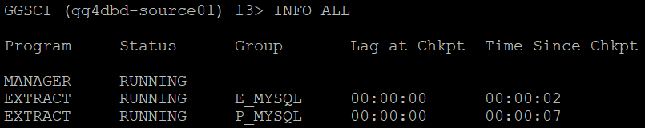
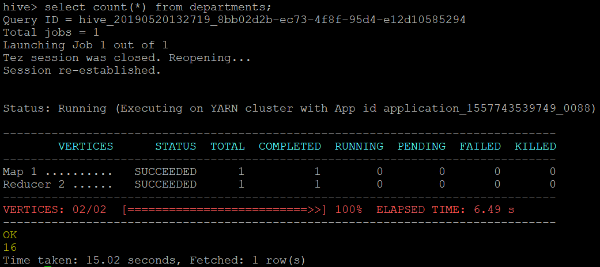

# Lab 700 -  MySQL to Hive


## Before You Begin

### Introduction
In this lab we will use goldengate for bigdata, which can replicate source transactional data to Hive. The Oracle GoldenGate for Big Data Handler allows you to populate data to Hive tables from existing Oracle GoldenGate supported sources.

### Objectives
- Replicate source transactional data to Hive using Oracle Goldengate for Bigdata.

### Time to Complete
Approximately 60 minutes

### What Do You Need?
Your will need:
- Goldengate for Bigdata

### STEP 1: Setting up the Environment For Connection to MySQL Database using Goldengate.
    
In this step we will set up the compute instace to be able to connect to MySQL  database using Goldengate Extract.

1. Logon to Goldengate command prompt for MySQL.

```
[oracle@gg4dbd-source01 18.1.0_GGMySQL]$ ./ggsci

Oracle GoldenGate Command Interpreter for MySQL
Version 18.1.0.0.0 OGGCORE_18.1.0.0.0_PLATFORMS_180928.0432
Linux, x64, 64bit (optimized), MySQL Enterprise on Sep 28 2018 19:34:16
Operating system character set identified as UTF-8.

Copyright (C) 1995, 2018, Oracle and/or its affiliates. All rights reserved.


GGSCI (gg4dbd-source01) 1>
```

2. Create a new extract "E_MYSQL" to connect to MySQL database.

```
GGSCI (gg4dbd-source01) 2> ADD EXTRACT E_MYSQL, TRANLOG, BEGIN NOW
```

3. Once the extract is created, create an exttrail for the extract

```
GGSCI (gg4dbd-source01) 3> ADD EXTTRAIL ./dirdat/ea, EXTRACT E_MYSQL
```

3. Include the below parameters in the Extract parameter file.

```
GGSCI (gg4dbd-source01) 3> EDIT PARAMS E_MYSQL
```

```
EXTRACT E_MYSQL
--------------------------------------------------------------------------
-- ADD EXTRACT E_MYSQL, TRANLOG, BEGIN NOW
-- ADD EXTTRAIL ./dirdat/ea, EXTRACT E_MYSQL
--------------------------------------------------------------------------
SETENV (MYSQL_HOME='/var/lib/mysql')
SETENV (MYSQL_UNIX_PORT='/var/lib/mysql/mysql.sock')
GETENV (MYSQL_HOME)
GETENV (MYSQL_TCP_PORT)
GETENV (MYSQL_UNIX_PORT)
sourcedb employees,userid ggbd,password W3lcome_123#
reportcount every 60 seconds, rate
EXTTRAIL ./dirdat/ea
TRANLOGOPTIONS ALTLOGDEST "/var/lib/mysql/binlog.index"
GETTRUNCATES;
TABLE employees.employees;
TABLE employees.departments;
TABLE employees.dept_manager;
TABLE employees.dept_emp;
TABLE employees.titles;
TABLE employees.salaries;
```

4. After adding the parameters in Extract parameter file, start the extract.

```
GGSCI (gg4dbd-source01) 6> START E_MYSQL
```


5. Now, create the pump and remote trail.

```
GGSCI (gg4dbd-source01) 7> ADD EXTRACT P_MYSQL, EXTTRAILSOURCE ./dirdat/ea
GGSCI (gg4dbd-source01) 8> ADD RMTTRAIL /u01/app/ggbd_home1/dirdat/eb, EXTRACT P_MYSQL
```

6. Edit the pump parameter file.

```
GGSCI (gg4dbd-source01) 10> EDIT PARAM P_MYSQL
```

Below is the sample pump parameter file.

```
EXTRACT P_MYSQL
--------------------------------------------------------------------------
-- ADD EXTRACT P_MYSQL, EXTTRAILSOURCE ./dirdat/ea
-- ADD RMTTRAIL /tmp/ggbd_home1/dirdat/ac, EXTRACT P_MYSQL
--------------------------------------------------------------------------
--RMTHOST 132.145.181.107, MGRPORT 7100
--RMTTRAIL /u01/app/ggbd_home1/dirdat/eb
RMTHOST 129.213.49.56, MGRPORT 7100
RMTTRAIL /tmp/ggbd_home1/dirdat/ac
PASSTHRU
REPORTCOUNT EVERY 60 SECONDS, RATE

TABLE employees.*;
```

7. Start the pump process and check the status of pump.

```
GGSCI (gg4dbd-source01) 11> START P_MYSQL
GGSCI (gg4dbd-source01) 12> INFO ALL
```



Extract and pump is configured for data capture on MySQL.

### STEP 2: Goldengate Replicat Setup for Hive.

1. We already have a trail file created in the GGBD home. We will be using the same trail file to replicate to Hbase.


Please refer to Lab 400 for more information

2. Add the replicat with the below commands.

```
GGSCI (gg4bd-target01) 4> ADD REPLICAT RHBASE, EXTTRAIL ./dirdat/eb
REPLICAT added.

GGSCI (gg4bd-target01) 5> edit param RHBASE
```

Add the below parameters in the parameter file :
```
REPLICAT rhbase
-- Trail file for this example is located in "AdapterExamples/trail" directory
-- Command to add REPLICAT
-- add replicat rhbase, exttrail AdapterExamples/trail/tr
TARGETDB LIBFILE libggjava.so SET property=dirprm/hbase.props
REPORTCOUNT EVERY 1 MINUTES, RATE
--GROUPTRANSOPS 10000
MAP employees.*, TARGET employees.*;
```

3. Now edit the dirprm/hbase.props file with the below parameters. You can use sample property files found in $GGBD_HOME/AdapterExamples/big-data/hbase. Make sure that hbase client libraries and configuration path is included in the "gg.classpath".
hbase libraries and configuration path for our lab are given below.

```
Hbase Libraries: /u01/app/jars/hbase_libs/hbase-1.3.4/lib
Hbase Configuration File Path: /u01/app/jars/hbase_libs/hbase-1.3.4/conf
gg.classpath=/u01/app/jars/hbase_libs/hbase-1.3.4/lib/*:/u01/app/jars/hbase_libs/hbase-1.3.4/conf
```

```
GGSCI (gg4bd-target01) 8> exit
[oracle@gg4bd-target01 ggbd_home1]$ cd dirprm
[oracle@gg4bd-target01 dirprm]$ vi hbase.props
```

Below are the parameters we will be using.

```

gg.handlerlist=hbase

gg.handler.hbase.type=hbase
gg.handler.hbase.hBaseColumnFamilyName=cf
gg.handler.hbase.keyValueDelimiter=CDATA[=]
gg.handler.hbase.keyValuePairDelimiter=CDATA[,]
gg.handler.hbase.encoding=UTF-8
gg.handler.hbase.pkUpdateHandling=update
gg.handler.hbase.nullValueRepresentation=CDATA[NULL]
gg.handler.hbase.authType=none
gg.handler.hbase.includeTokens=false

gg.handler.hbase.mode=tx

goldengate.userexit.writers=javawriter
javawriter.stats.display=TRUE
javawriter.stats.full=TRUE

gg.log=log4j
gg.log.level=INFO

gg.report.time=30sec

#Sample gg.classpath for Apache HBase
gg.classpath=/u01/app/jars/hbase_libs/hbase-1.3.4/lib/*:/u01/app/jars/hbase_libs/hbase-1.3.4/conf
#gg.classpath=/var/lib/hbase/lib/*:/var/lib/hbase/conf:
#Sample gg.classpath for CDH
#gg.classpath=/opt/cloudera/parcels/CDH/lib/hbase/lib/*:/etc/hbase/conf
#Sample gg.classpath for HDP
#gg.classpath=/usr/hdp/current/hbase-client/lib/*:/etc/hbase/conf

javawriter.bootoptions=-Xmx512m -Xms32m -Djava.class.path=ggjava/ggjava.jar
```


4. Now goto ggsci prompt and you will see the replicat RHBASE. start the replicat and see the data in the Hbase.

```
[oracle@gg4bd-target01 ggbd_home1]$ ./ggsci
GGSCI (gg4bd-target01) 1> start RHBASE
GGSCI (gg4bd-target01) 1> stats RHBASE
```


5. You will be able to see the tables created in Hbase.


### STEP 3: Verifying the Data in Remote Hbase

1. Logon to the big data compute machine where hbase is installed. In this lab, remote host is "129.213.49.56".  


```
login as: opc
Authenticating with public key "imported-openssh-key"
Last login: Tue May 14 11:45:17 2019 from pool-72-83-65-125.washdc.fios.verizon.net
```

2. Sudo to hbase user.

```
[opc@gg4bd01-bdcsce-1 ~]$ sudo su - hbase
Last login: Mon May 13 14:23:20 UTC 2019 on pts/6
```

3. Logon to hbase shell and execute list command to see the tables in Hbase.

```
[hbase@gg4bd01-bdcsce-1 ~]$ hbase shell
SLF4J: Class path contains multiple SLF4J bindings.
SLF4J: Found binding in [jar:file:/u01/bdcsce/usr/hdp/2.4.2.0-258/hadoop/lib/slf4j-log4j12-1.7.10.jar!/org/slf4j/impl/StaticLoggerBinder.class]
SLF4J: Found binding in [jar:file:/u01/bdcsce/usr/hdp/2.4.2.0-258/zookeeper/lib/slf4j-log4j12-1.6.1.jar!/org/slf4j/impl/StaticLoggerBinder.class]
SLF4J: See http://www.slf4j.org/codes.html#multiple_bindings for an explanation.
SLF4J: Actual binding is of type [org.slf4j.impl.Log4jLoggerFactory]
HBase Shell; enter 'help<RETURN>' for list of supported commands.
Type "exit<RETURN>" to leave the HBase Shell
Version 1.3.1.2.4.2.0-258, rUnknown, Fri Nov 17 19:27:17 UTC 2017

hbase(main):001:0>
```


4. Now, check the count of records in a table using below count command.

```
hbase(main):004:0> count 'employees:salaries'
Current count: 1000, row: 10101|1998-10-14
1044 row(s) in 0.2120 seconds

=> 1044
```


5. To see the data in Hbase tables, use scan command.

```
hbase(main):007:0>scan 'employees:salaries'
ROW                                      COLUMN+CELL
 10001|1986-06-26                        column=cf:EMP_NO, timestamp=1557758066142, value=10001
 10001|1986-06-26                        column=cf:FROM_DATE, timestamp=1557758066142, value=1986-06-26
 10001|1986-06-26                        column=cf:SALARY, timestamp=1557758066142, value=60117
 10001|1986-06-26                        column=cf:TO_DATE, timestamp=1557758066142, value=1987-06-26
 10001|1987-06-26                        column=cf:EMP_NO, timestamp=1557758066142, value=10001
```



You have completed lab 700! Great Job!