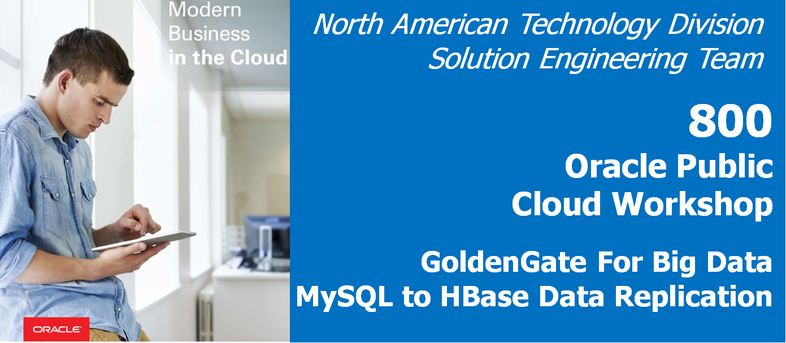
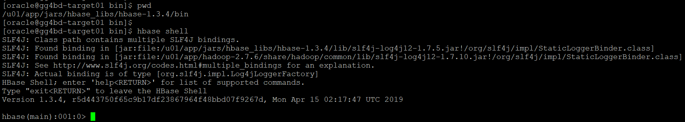
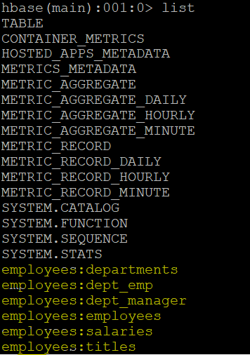

# Lab 800 -  MySQL to Hbase


## Before You Begin

### Introduction
In this lab we will use goldengate for bigdata, which can replicate source transactional data to Hbase database. The Oracle GoldenGate for Big Data Handler for HBase allows you to populate HBase tables from existing Oracle GoldenGate supported sources.

### Objectives
- Replicate source transactional data to Hbase database using Oracle Goldengate for Bigdata.

### Time to Complete
Approximately 60 minutes

### What Do You Need?
Your will need:
- Goldengate for Bigdata
- Hbase client to access the Hbase in remote location

### STEP 1: Setting up the Environment For Connection to Hbase Database.
    
In this step we will set up the compute instace to be able to connect to Hbase  database.

1. Download Hbase client tar file from the <a href='https://www.apache.org/dyn/closer.lua/hbase/1.3.4/hbase-1.3.4-bin.tar.gz'> Apache Web Site </a>

```
[opc@gg4bd-target01 ~]$ sudo su - oracle
Last login: Mon May  6 09:22:44 GMT 2019 on pts/0
[oracle@gg4bd-target01 ~]$ wget <HBASE_CLIENT_DOWNLOAD_LINK>
```

2. Once the file is downloaded, unzip and untar the file.

```
[opc@gg4bd-target01 ~]$ gunzip hbase-1.3.4-bin.tar.gz
[oracle@gg4bd-target01 ~]$ tar -xvf hbase-1.3.4-bin.tar
```

3. After executing the untar command, hbase folden with name hbase-1.x.x will be created. The path for hbase-1.x.x folder will be your HBASE_HOME.

```
[oracle@gg4bd-target01 Downloads]$ cd hbase-1.3.4
[oracle@gg4bd-target01 ~]$ pwd
/u01/app/jars/hbase_libs/hbase-1.3.4
```
Now Hbase client is installed in your Big Data Compute. We need to configure the Hbase client to connect to remote Hbase database

3. locate the "hbase-site.xml" file in the big data host and copy the configuration to <HBASE_HOME>/conf/hbase-site.xml file.  

```
[oracle@gg4bd-target01 hbase-1.3.4]$ pwd
/u01/app/jars/hbase_libs/hbase-1.3.4
[oracle@gg4bd-target01 hbase-1.3.4]$ cd conf/
[oracle@gg4bd-target01 conf]$ ls
hadoop-metrics2-hbase.properties  hbase-env.cmd  hbase-env.sh  hbase-policy.xml  hbase-site.xml  log4j.properties  regionservers
[oracle@gg4bd-target01 conf]$ cp hbase-site.xml hbase-site.xml_bkp
[oracle@gg4bd-target01 conf]$ vi hbase-site.xml
```

4. Replace the host name in hbase-site.xml file with the remote host name ip address in the hbase.zookeeper.quorum property.

```
[oracle@gg4bd-target01 conf]$ vi hbase-site.xml
```


After changing the host name, save the changes and exit from vi editor.

5. Go to <HBASE_HOME>/bin path and execute "hbase shell" command to check if hbase client is connecting to remote hbase database.

```
[oracle@gg4bd-target01 hbase-1.3.4]$ pwd
/u01/app/jars/hbase_libs/hbase-1.3.4
[oracle@gg4bd-target01 hbase-1.3.4]$ cd bin
[oracle@gg4bd-target01 bin]$
[oracle@gg4bd-target01 bin]$ pwd
/u01/app/jars/hbase_libs/hbase-1.3.4/bin
[oracle@gg4bd-target01 bin]$
[oracle@gg4bd-target01 bin]$ hbase shell
```



The connection is successful to remote hbase database.

### STEP 2: Goldengate Replicat Setup for Hbase.

1. We already have a trail file created in the GGBD home. We will be using the same trail file to replicate to Hbase.


Please refer to Lab 400 for more information

2. Add the replicat with the below commands.

```
GGSCI (gg4bd-target01) 4> ADD REPLICAT RHBASE, EXTTRAIL ./dirdat/eb
REPLICAT added.

GGSCI (gg4bd-target01) 5> edit param RHBASE
```

Add the below parameters in the parameter file :
```
REPLICAT rhbase
-- Trail file for this example is located in "AdapterExamples/trail" directory
-- Command to add REPLICAT
-- add replicat rhbase, exttrail AdapterExamples/trail/tr
TARGETDB LIBFILE libggjava.so SET property=dirprm/hbase.props
REPORTCOUNT EVERY 1 MINUTES, RATE
--GROUPTRANSOPS 10000
MAP employees.*, TARGET employees.*;
```

3. Now edit the dirprm/hbase.props file with the below parameters. You can use sample property files found in $GGBD_HOME/AdapterExamples/big-data/hbase. Make sure that hbase client libraries and configuration path is included in the "gg.classpath".
hbase libraries and configuration path for our lab are given below.

```
Hbase Libraries: /u01/app/jars/hbase_libs/hbase-1.3.4/lib
Hbase Configuration File Path: /u01/app/jars/hbase_libs/hbase-1.3.4/conf
gg.classpath=/u01/app/jars/hbase_libs/hbase-1.3.4/lib/*:/u01/app/jars/hbase_libs/hbase-1.3.4/conf
```

```
GGSCI (gg4bd-target01) 8> exit
[oracle@gg4bd-target01 ggbd_home1]$ cd dirprm
[oracle@gg4bd-target01 dirprm]$ vi hbase.props
```

Below are the parameters we will be using.

```

gg.handlerlist=hbase

gg.handler.hbase.type=hbase
gg.handler.hbase.hBaseColumnFamilyName=cf
gg.handler.hbase.keyValueDelimiter=CDATA[=]
gg.handler.hbase.keyValuePairDelimiter=CDATA[,]
gg.handler.hbase.encoding=UTF-8
gg.handler.hbase.pkUpdateHandling=update
gg.handler.hbase.nullValueRepresentation=CDATA[NULL]
gg.handler.hbase.authType=none
gg.handler.hbase.includeTokens=false

gg.handler.hbase.mode=tx

goldengate.userexit.writers=javawriter
javawriter.stats.display=TRUE
javawriter.stats.full=TRUE

gg.log=log4j
gg.log.level=INFO

gg.report.time=30sec

#Sample gg.classpath for Apache HBase
gg.classpath=/u01/app/jars/hbase_libs/hbase-1.3.4/lib/*:/u01/app/jars/hbase_libs/hbase-1.3.4/conf
#gg.classpath=/var/lib/hbase/lib/*:/var/lib/hbase/conf:
#Sample gg.classpath for CDH
#gg.classpath=/opt/cloudera/parcels/CDH/lib/hbase/lib/*:/etc/hbase/conf
#Sample gg.classpath for HDP
#gg.classpath=/usr/hdp/current/hbase-client/lib/*:/etc/hbase/conf

javawriter.bootoptions=-Xmx512m -Xms32m -Djava.class.path=ggjava/ggjava.jar
```


4. Now goto ggsci prompt and you will see the replicat RHBASE. start the replicat and see the data in the Hbase.

```
[oracle@gg4bd-target01 ggbd_home1]$ ./ggsci
GGSCI (gg4bd-target01) 1> start RHBASE
GGSCI (gg4bd-target01) 1> stats RHBASE
```


5. You will be able to see the tables created in Hbase.


### STEP 3: Verifying the Data in Remote Hbase

1. Logon to the big data compute machine where hbase is installed. In this lab, remote host is "129.213.49.56".  


```
login as: opc
Authenticating with public key "imported-openssh-key"
Last login: Tue May 14 11:45:17 2019 from pool-72-83-65-125.washdc.fios.verizon.net
```

2. Sudo to hbase user.

```
[opc@gg4bd01-bdcsce-1 ~]$ sudo su - hbase
Last login: Mon May 13 14:23:20 UTC 2019 on pts/6
```

3. Logon to hbase shell and execute list command to see the tables in Hbase.

```
[hbase@gg4bd01-bdcsce-1 ~]$ hbase shell
SLF4J: Class path contains multiple SLF4J bindings.
SLF4J: Found binding in [jar:file:/u01/bdcsce/usr/hdp/2.4.2.0-258/hadoop/lib/slf4j-log4j12-1.7.10.jar!/org/slf4j/impl/StaticLoggerBinder.class]
SLF4J: Found binding in [jar:file:/u01/bdcsce/usr/hdp/2.4.2.0-258/zookeeper/lib/slf4j-log4j12-1.6.1.jar!/org/slf4j/impl/StaticLoggerBinder.class]
SLF4J: See http://www.slf4j.org/codes.html#multiple_bindings for an explanation.
SLF4J: Actual binding is of type [org.slf4j.impl.Log4jLoggerFactory]
HBase Shell; enter 'help<RETURN>' for list of supported commands.
Type "exit<RETURN>" to leave the HBase Shell
Version 1.3.1.2.4.2.0-258, rUnknown, Fri Nov 17 19:27:17 UTC 2017

hbase(main):001:0>
```




4. Now, check the count of records in a table using below count command.

```
hbase(main):004:0> count 'employees:salaries'
Current count: 1000, row: 10101|1998-10-14
1044 row(s) in 0.2120 seconds

=> 1044
```


5. So see the data use scan command.

```
hbase(main):007:0>scan 'employees:salaries'
ROW                                      COLUMN+CELL
 10001|1986-06-26                        column=cf:EMP_NO, timestamp=1557758066142, value=10001
 10001|1986-06-26                        column=cf:FROM_DATE, timestamp=1557758066142, value=1986-06-26
 10001|1986-06-26                        column=cf:SALARY, timestamp=1557758066142, value=60117
 10001|1986-06-26                        column=cf:TO_DATE, timestamp=1557758066142, value=1987-06-26
 10001|1987-06-26                        column=cf:EMP_NO, timestamp=1557758066142, value=10001
```


You have completed lab 800! Great Job!