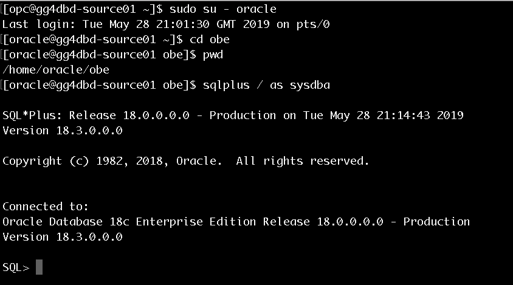
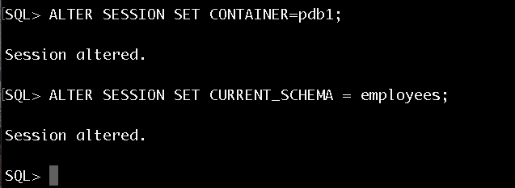
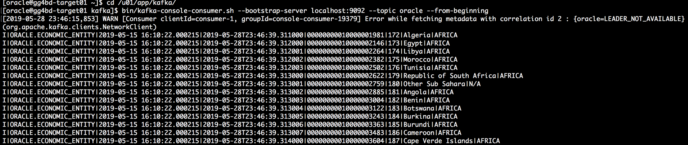

# Lab 900 -  Oracle to Kafka (json format) / EventHub

## Before You Begin
- We should have Oracle installed on the source compute instance.
- We should have [Quickstart Kafka](https://kafka.apache.org/quickstart) setup on the target compute instance.
- We require to have golden gate binaries installed for the Oracle database on the source side.
- We require to have golden gate for Big Data binaries installed on the target side.


### Introduction
Provision Golden Gate for Kafka to simplify your data integration by working with on-premises and cloud data source/targets and accepting data in any shape or format. This labs will guide through the steps required to start a replication stream between an Oracle database and a Kafka queue.

### Objectives
- Extract from Oracle to generate the Trail Files on Source
- Dump the trail files from Source to target machine
- Replicate from trail files on the target machine to Kafka topic.

### Time to Complete
Approximately 30 minutes


### What Do You Need?
You will need:
- Putty if you are using windows machine

## Setup the Oracle Database on Source to extract the trail Files

##### 1. Create economic_entity table to be used for replication.
For this workshop we are going to use economic_entity table.This zip has the DDL command and sample Insert commands scripts for the economic_entity table.
Download the [OBE_DDL_FILES.zip]( https://www.oracle.com/webfolder/technetwork/tutorials/obe/fmw/goldengate/12c/OGG12c_Integrated_Replicat/files/OBE_DDL_FILES.zip ) file containing the sql scripts on your source machine.
Create the obe directory in the oracle user's default path (the absolute pathname will be:/home/oracle/obe) Download the zip file containing the sql scripts for this OBE. Copy the downloaded zip file into the /home/oracle/obe directory

```
[opc@gg4dbd-source01 ~]$ sudo su - oracle
Last login: Tue May 28 21:01:30 GMT 2019 on pts/0
[oracle@gg4dbd-source01 ~]$ mkdir obe

```

##### 2. Copy the zip file into the obe directory. The downloaded file is by default stored into the /home/oracle/Downloads directory.

```
[oracle@gg4dbd-source01 ~]$ cp ./Downloads/OBE_DDL_FILES.zip ./obe
[oracle@gg4dbd-source01 obe]$ unzip OBE_DDL_FILES.zip

```


##### 3. Connect to the Oracle Database PDB (pdb1) and use employees schema
  Make sure your default directory is /home/oracle/obe and launch sqlplus

```

[opc@gg4dbd-source01 ~]$ sudo su - oracle
Last login: Tue May 28 21:01:30 GMT 2019 on pts/0
[oracle@gg4dbd-source01 ~]$ cd obe
[oracle@gg4dbd-source01 obe]$ pwd
/home/oracle/obe
[oracle@gg4dbd-source01 obe]$ sqlplus / as sysdba

SQL*Plus: Release 18.0.0.0.0 - Production on Tue May 28 21:14:43 2019
Version 18.3.0.0.0

Copyright (c) 1982, 2018, Oracle.  All rights reserved.


Connected to:
Oracle Database 18c Enterprise Edition Release 18.0.0.0.0 - Production
Version 18.3.0.0.0

SQL>

```




##### 4. Alter session and set the container to pdb1 and current working schema as employees




```
SQL> ALTER SESSION SET CONTAINER=pdb1;

Session altered.

SQL> ALTER SESSION SET CURRENT_SCHEMA = employees;

Session altered.

SQL>

```

##### 5. Execute the create table and economic_entity insert script form the SQL commandline

  Run the oracle_table_creation.sql script

```

SQL> @oracle_table_creation.sql

Table created.

Table created.

Table created.

SQL>  select table_name from user_tables;

TABLE_NAME
--------------------------------------------------------------------------------              
ECONOMIC_ENTITY
GDP_BY_YEAR
GDP_GROWTH_BY_YEAR

SQL>

```

  Run the the economic_entity.sql script to populate the ECONOMIC_ENTITY table.

 ```

 SQL> @economic_entity.sql
 1 row created.
 1 row created.
  ... many lines omitted for clarity ...
 1 row created.

 Commit complete.

 SQL>  select count(*) from economic_entity;                                                   

   COUNT(*)
 ----------
        235

 SQL>

 ```

##### 6. Create a user and grant DBA privilege to that user (gguser in this case)

```
SQL> create user gguser identified by gguser ;

User created.

SQL> grant dba to gguser;

Grant succeeded.

```

##### 7. Add Trandata for the table to be replicated from the GGSCI command line.
  Go the the installation directory of Goldengate and start the GGSCI Command line using the ./ggsci command


```
[oracle@gg4dbd-source01]$ locate ggsci
/u01/app/gghome/ggsci
[oracle@gg4dbd-source01]$ cd /u01/app/gghome
[oracle@gg4dbd-source01 gghome]$ ./ggsci

Oracle GoldenGate Command Interpreter for Oracle
Version 18.1.0.0.0 OGGCORE_18.1.0.0.0_PLATFORMS_180928.0432_FBO
Linux, x64, 64bit (optimized), Oracle 18c on Sep 29 2018 07:21:38
Operating system character set identified as UTF-8.

Copyright (C) 1995, 2018, Oracle and/or its affiliates. All rights reserved.


GGSCI (gg4dbd-source01) 1>

```

  Login to the Database from the GGSCI commandline

  ```
    GGSCI (gg4dbd-source01) 1> dblogin userid gguser@pdb1 ,password gguser
    Successfully logged into database PDB1.

    GGSCI (gg4dbd-source01 as gguser@cdb1/PDB1) 4>

  ```


  Add Trandata for the table to be replicated (economic_entity) using the below commands

```

  GGSCI (gg4dbd-source01 as gguser@cdb1/PDB1) 4> add trandata employees.economic_entity

  2019-05-15 16:07:19  INFO    OGG-15132  Logging of supplemental redo data enabled for table PDB1.EMPLOYEES.ECONOMIC_ENTITY.

  2019-05-15 16:07:19  INFO    OGG-15133  TRANDATA for scheduling columns has been added on table PDB1.EMPLOYEES.ECONOMIC_ENTITY.

  2019-05-15 16:07:19  INFO    OGG-15135  TRANDATA for instantiation CSN has been added on table PDB1.EMPLOYEES.ECONOMIC_ENTITY.

  2019-05-15 16:07:19  INFO    OGG-10471  ***** Oracle Goldengate support information on table EMPLOYEES.ECONOMIC_ENTITY *****
  Oracle Goldengate support native capture on table EMPLOYEES.ECONOMIC_ENTITY.
  Oracle Goldengate marked following column as key columns on table EMPLOYEES.ECONOMIC_ENTITY: ENTITY_ID.

  GGSCI (gg4dbd-source01 as gguser@cdb1/PDB1) 5>

```


## Extract from Oracle to generate the Trail Files on Source

##### 1. Go to the directory where your ggsci is installed and run it.

```
[oracle@gg4dbd-source01 ogg123]$ ./ggsci

Oracle GoldenGate Command Interpreter for Oracle
Version 12.3.0.1.4 OGGCORE_12.3.0.1.0_PLATFORMS_180415.0359_FBO
Linux, x64, 64bit (optimized), Oracle 12c on Apr 16 2018 00:53:30
Operating system character set identified as UTF-8.

Copyright (C) 1995, 2018, Oracle and/or its affiliates. All rights reserved.


GGSCI (gg4dbd-source01) 1>
```
##### 2. Add your extract file.
```
GGSCI (gg4dbd-source01) 3> edit params E_ORACLE
```
Paste the below content to the file and save.

```
Extract E_Oracle
SETENV (ORACLE_SID='cdb1')
USERID gguser,PASSWORD gguser
TranlogOptions IntegratedParams (max_sga_size 256)
Exttrail ./dirdat/et
LOGALLSUPCOLS
Table pdb1.employees.economic_entity;

```

##### 3. Now from the GGSCI commandline register and add the Extract using below commands.


```

GGSCI (gg4dbd-source01) 1> dblogin userid gguser@pdb1 ,password gguser
Successfully logged into database PDB1.

GGSCI (gg4dbd-source01 as gguser@cdb1/PDB1) 2> register extract E_Oracle database
Extract E_Oracle successfully registered with database at SCN 1905933.
GGSCI (gg4dbd-source01 as gguser@cdb1/PDB1) 3> ADD EXTRACT E_Oracle,INTEGRATED TRANLOG, BEGIN NOW
EXTRACT added.
GGSCI (gg4dbd-source01 as gguser@cdb1/PDB1) 4> ADD EXTTRAIL ./dirdat/et, EXTRACT E_Oracle
EXTTRAIL added.

```

## Pump the trail files from Source to target machine

##### 1. Go to the directory where your ggsci is there and run it.

```
[oracle@gg4dbd-source01 ogg123]$ ./ggsci

Oracle GoldenGate Command Interpreter for Oracle
Version 12.3.0.1.4 OGGCORE_12.3.0.1.0_PLATFORMS_180415.0359_FBO
Linux, x64, 64bit (optimized), Oracle 12c on Apr 16 2018 00:53:30
Operating system character set identified as UTF-8.

Copyright (C) 1995, 2018, Oracle and/or its affiliates. All rights reserved.


GGSCI (gg4dbd-source01) 1>
```
##### 2. Create a dump process using the below commands.

```
GGSCI (gg4dbd-source01) 3> edit param P_ORACLE

```
Add the below content into the pump file and replace the <IPAddress> with the public IP address of your remote target machine and save it.
Here the rmtrail is the remote trail file location where you want to save the trail files from the source Database.(We generally save the trail files in the dirdat directory present inside the Golden Gate installation and the file name can only contain 2 letters).In this case we have cerated a directory oraTrails inside the dirdat directory (You can create the same or with other name or just pump the trail files into the dirdat directory itself).

```
Extract P_Oracle
SETENV (ORACLE_SID='cdb1')
UserId gguser,password gguser
rmthost 132.145.181.107, mgrport 7110
rmttrail ./dirdat/oraTrails/tr
table pdb1.employees.*;

```
##### 3. Now add the Pump process using below commands.

```

GGSCI (gg4dbd-source01) 4> add extract P_Oracle, exttrailsource ./dirdat/et
EXTRACT added.
GGSCI (gg4dbd-source01) 5> add rmttrail ./dirdat/oraTrails/tr, extract P_Oracle
RMTTRAIL added.

```

## Replicat from trail files on the target machine to Kafka topic.

Now we will be working on the Target machine.We have a trail file created in the GGBD home in the /dirdat/oraTrails directory with the name tr. We will be using this  trail file to send to a Kafka topic.


##### 1. Create the kafka.props file in dirprm folder in your Golden Gate installation folder in your target machine.
```
[oracle@gg4bd-target01 ggbd_home1]$ cd dirprm
[oracle@gg4bd-target01 dirprm]$ vi kafka.props
```
Copy paste the below text in kafka.props.

```
## RKAFKA properties for Kafka Topic apply
gg.handlerlist=kafkahandler
gg.handler.kafkahandler.type=kafka
gg.handler.kafkahandler.KafkaProducerConfigFile=producer.properties
gg.handler.kafkahandler.topicMappingTemplate=oracle
gg.handler.kafkahandler.keyMappingTemplate=${currentTimestamp}
gg.handler.kafkahandler.format=delimitedtext
gg.handler.kafkahandler.format.fieldDelimiter=|
gg.handler.kafkahandler.SchemaTopicName=testSchema
gg.handler.kafkahandler.BlockingSend=true
gg.handler.kafkahandler.includeTokens=false
gg.handler.kafkahandler.mode=tx
goldengate.userexit.timestamp=utc
goldengate.userexit.writers=javawriter
javawriter.stats.display=TRUE
javawriter.stats.full=TRUE
gg.log=log4j
gg.log.level=INFO
gg.report.time=30sec
gg.classpath=dirprm/:/u01/app/kafka/libs/*:/u01/app/kafka/config
javawriter.bootoptions=-Xmx512m -Xms32m -Djava.class.path=ggjava/ggjava.jar
gg.handler.kafkahandler.format.pkUpdateHandling=update
```
Save the text using wq!

##### 2. Add the replicat with the below commands.
```
GGSCI (gg4bd-target01) 1> edit param RKAFKA
```
Add the below content into RKAFKA.
```
REPLICAT RKAFKA
TARGETDB LIBFILE libggjava.so SET property=dirprm/kafka.props
GROUPTRANSOPS 10000
MAP pdb1.employees.economic_entity, TARGET oracle.*;
```

##### 3. Add the replicat with the below command.

```
add replicat RKAFKA, exttrail ./dirdat/oraTrails/tr
```
## Test if the changes made in Oracle Database are getting reflected in the Kafka Topic.

For this Lab, we are using the Kafka Quickstart to quickly launch Kafka server.More details can be found [here](https://kafka.apache.org/quickstart).

##### 1. Go to the Kafka Installation folder.
```
[oracle@gg4bd-target01 app]$ cd kafka
[oracle@gg4bd-target01 kafka]$ ls
bin  config  libs  LICENSE  logs  NOTICE  site-docs
```
##### 2. Start the zookeeper server using the below command.

```
[oracle@gg4bd-target01 kafka]$ bin/zookeeper-server-start.sh config/zookeeper.properties
```
##### 3. Open another terminal and go to the same Kafka folder and start the Kafka server using below command.

```
[oracle@gg4bd-target01 kafka]$ bin/kafka-server-start.sh config/server.properties
```
##### 4. Open another terminal and go to the same Kafka folder and create a Kafka topic named "oracle"  using the below command
```
bin/kafka-topics.sh --create --bootstrap-server localhost:9092 --replication-factor 1 --partitions 1 --topic oracle
```
##### 4. Open another terminal again and go to the same Kafka folder and start the consumer for topic "oracle".
```
[oracle@gg4bd-target01 kafka]$ bin/kafka-console-consumer.sh --bootstrap-server localhost:9092 --topic oracle --from-beginning
```

##### 5. View the records being added to the Kafka topic.These are the same records inserted into the economic_entity table in the Oracle Database in the previous steps.



##### 6. Test by inserting more records
To test more, insert more records into the economic_entity table in the Oracle Database.Make sure that the Zookeeper server,Kafka server and Kafka consumer for topic "oracle" are up and running during this time.You will see the inserted data being added to the oracle topic in the consumer.
