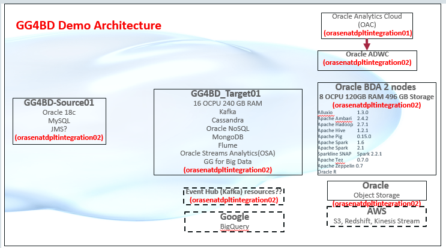

# Goldengate for Big Data

## How to Prepare for This Workshop 

- Once you are viewing the workshop's gitHub page's website, you can see a list of Lab Guides at any time by clicking on the **Menu Icon**

## Oracle Golgengate for Big Data Workshop

Welcome to the Golden Gate for Big Data Workshop. The content will give you a basic understanding of Golden Gate and Big Data Cloud Service and many of the capabilities related to provisioning, data preparation and internals.  The labs are as follows:
-  Lab 100 - Provisioning Golden Gate for Big Data
-  Lab 200 - Provisioning and accessing BigData
-  Lab 300 - Using BigData Components (Hadoop, Hive, Pig, Spark, Oracle R)
-  Lab 400 - MySQL to MySQL
-  Lab 500 - MySQL to File Writer Handler (csv/parquet format)
-  Lab 600 - MySQL to HDFS (json / text / avro / ocf format)
-  Lab 700 - MySQL to Hive (avro format - Metadata providers)
-  Lab 800 - MySQL to Hbase
-  Lab 900 - Oracle to Kafka (json / avro format)/ Eventhub
-  Lab 1000 - MySQL to Cassandra
-  Lab 1100 - MySQL to Oracle (using jdbc)
-  Lab 1300 - MySQL to MongoDB
-  Lab 1400 - MySQL to Flume

## Workshop architecture
 

- Source: GG4BD_Source1
- Target: GG4BD_Target1
- On-Prem: Cloud Compute Instance that will simulate an On-Prem environment

## Workshop Details

**Reference the following Lab Guides by opening their Documentation Files:**

## Lab 100 - Provisioning Golden Gate for Big Data

**Documentation**: [CloudWorkshop\_GG4BD\_100.md](CloudWorkshop\_GG4BD\_100.md)

### Objectives

-   Installation of Golden Gate for Big Data 12.3.2.1

## Lab 200 - Provisioning and accessing BigData

**Documentation**: [CloudWorkshop\_GG4BD\_200.md](CloudWorkshop_GG4BD_200.md)

### Objectives
- Provision Big Data Cloud instance

## Lab 300 - Using BigData Components (Hadoop, Hive, Pig, Spark, Oracle R)

**Documentation**: [CloudWorkshop\_GG4BD\_300.md](CloudWorkshop\_GG4BD\_300.md)

### Objectives
-	Overview about different Golden Gate big data Products.

## Lab 400 - MySQL to MySQL

**Documentation**: [CloudWorkshop\_GG4BD\_400.md](CloudWorkshop\_GG4BD\_400.md)

### Objectives
-   Goldengate replication for MySQL to capture CDC from MySQL

## Lab 500 - MySQL to File Writer Handlerta

**Documentation**: [CloudWorkshop\_GG4BD\_500.md](CloudWorkshop\_GG4BD\_500.md)

### Objectives
-   Goldengate BigData Java Database Connectivity (JDBC) Handler to replicate source transactional data to a target or database.

## Lab 600 - MySQL to HDFS

**Documentation**: [CloudWorkshop\_GG4BD\_600.md](CloudWorkshop\_GG4BD\_600.md)

### Objectives
-   GoldenGate replication from MySQL to HDFS

## Lab 700 - MySQL to Hive

**Documentation**: [CloudWorkshop\_GG4BD\_700.md](CloudWorkshop\_GG4BD\_700.md)

### Objectives
- Replicate source transactional data to Hive using Oracle Goldengate for Bigdata.

## Lab 800 - MySQL to Hbase

**Documentation**: [CloudWorkshop\_GG4BD\_800.md](CloudWorkshop\_GG4BD\_800.md)

### Objectives
-   Replicate source transactional data to Hbase database using Oracle Goldengate for Bigdata

## Lab 900 - Oracle to Kafka

**Documentation**: [CloudWorkshop\_GG4BD\_900.md](CloudWorkshop\_GG4BD\_900.md)

### Objectives
-   Extract from Oracle to generate the Trail Files on Source
-   Dump the trail files from Source to target machine
-   Replicate from trail files on the target machine to Kafka topic.

## Lab 1000 - MySQL to Cassandra

**Documentation**: [CloudWorkshop\_GG4BD\_1000.md](CloudWorkshop\_GG4BD\_1000.md)

### Objectives
-   Goldengate replication for Cassandra to capture CDC from MySQL

## Lab 1100 - MySQL to Oracle (using jdbc)

**Documentation**: [CloudWorkshop\_GG4BD\_1100.md](CloudWorkshop\_GG4BD\_1100.md)

### Objectives
-   Replicate from MySQL to Oracle using jdbc

## Lab 1300 - MySQL to MongoDB

**Documentation**: [CloudWorkshop\_GG4BD\_1300.md](CloudWorkshop\_GG4BD\_1300.md)

### Objectives
-   Replicate from MySQL to MongoDB

## Lab 1400 - MySQL to Flume

**Documentation**: [CloudWorkshop\_GG4BD\_1400.md](CloudWorkshop\_GG4BD\_1400.md)

### Objectives
-   Goldengate BigData replication to Apache Flume

