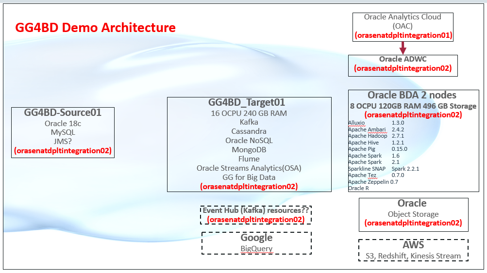

# GG4BigData

## How to Prepare for This Workshop 

- Once you are viewing the workshop's gitHub page's website, you can see a list of Lab Guides at any time by clicking on the **Menu Icon**

## Oracle Data Integration Platform Cloud (DIPC) Services Workshop

Welcome to the Golden Gate for Big Data Workshop. The content will give you a basic understanding of Golden Gate and Big Data Cloud Service and many of the capabilities related to provisioning, data preparation and internals.  The labs are as follows:
-  Lab 100 - Provisioning Golden Gate for Big Data
-  Lab 200 - Provisioning and accessing BigData
-  Lab 300 - Using BigData Components (Hadoop, Hive, Pig, Spark, Oracle R)
-  Lab 400 - Provisioning Kafka, Oracle EventHub
-  Lab 500 - Kafka and EventHub Overview
-  Lab 600 - Oracle to Kafka Integration
-  Lab 700 - 
-  Lab 800 - 
-  Lab 1000 - 
-  Lab 1200 - 
-  Lab 1300 - 
- Appendix 1 - 
- Appendix 2 - 
- Appendix 3 - 

## Workshop architecture
 

- Source: 
- Target: 
- On-Prem: Cloud Compute Instance that will simulate an On-Prem environment

## Workshop Details

**Reference the following Lab Guides by opening their Documentation Files:**

## Lab 100: Provisioning DIPCS

**Documentation**: [CloudWorkshop\_DIPC\_100.md](CloudWorkshop\_DIPC\_100.md)

### Objectives

-   Provision a Data Integration Cloud Service instance.

## Lab 200: Sync Elevated Task

**Documentation**: [CloudWorkshop\_DIPC\_200.md](CloudWorkshop\_DIPC\_200.md)

### Objectives
- Review how to create connections
- Review how to execute a Synchonize Data elevated task

## Lab 300: Remote Agent Install & Sync on-prem databases

**Documentation**: [CloudWorkshop\_DIPC\_300.md](CloudWorkshop\_DIPC\_300.md)

### Objectives
-	Review downloading process, installation and configuration of DIPC remote agent
-   Synchronize two On-Premise Databases

## Lab 400:  Migrate on-prem to Cloud

**Documentation**: [CloudWorkshop\_DIPC\_400.md](CloudWorkshop\_DIPC\_400.md)

### Objectives
-   Review downloading process, installation and configuration of DIPC remote agent
-   Migrate an on-prem database to a database cloud service

## Lab 500:  Prepare Data

**Documentation**: [CloudWorkshop\_DIPC\_500.md](CloudWorkshop\_DIPC\_500.md)

### Objectives
-   Prepare data from flat files
-   Transform data elements
-   Administer transformations

## Lab 600:  ODI Execution Task

**Documentation**: [CloudWorkshop\_DIPC\_600.md](CloudWorkshop\_DIPC\_600.md)

### Objectives
-   Undertsand how to import ODI scenarios
-   Execute and monitor ODI scenarios using DIPC

## Lab 700:  Under the covers DIPCS

**Documentation**: [CloudWorkshop\_DIPC\_700.md](CloudWorkshop\_DIPC\_700.md)

### Objectives
- Demonstrate how to work directly with underneath DIPC GG "engine"
- Demonstrate how to work directly with underneath DIPC ODI "engine"
- Demonstrate how to work directly with underneath DIPC EDQ "engine"
- Understand underlying DIPC architecture
- Review default Oracle Golden Gate configurations
- Review weblogic components
- Revew required ports for communication between agent and DIPC console

## Lab 800:  Data Lake Builder Elevated Task

**Documentation**: [CloudWorkshop\_DIPC\_800.md](CloudWorkshop\_DIPC\_800.md)

### Objectives
-   Review how to create connections to Oracle Object Storage
-   Review how to execute a Data Lake Builder task

## Lab 1000:  Replicate Data to ADWC

**Documentation**: [CloudWorkshop\_DIPC\_1000.md](CloudWorkshop\_DIPC\_1000.md)

### Objectives
-   Review how to create connections
-   Review how to execute a Replicate Data elevated task for Autonomous Data Warehouse

## Lab 1200:  Enterprise Data Quality (EDQ)

**Documentation**: [CloudWorkshop\_DIPC\_1200.md](CloudWorkshop\_DIPC\_1200.md)

### Objectives
-   Review EDQ Capabilities
-   Connect to sample data, understand how to profile the data and know how to correct the data in EDQ

## Lab 1300:  Replicate Data - Oracle to Kafka

**Documentation**: [CloudWorkshop\_DIPC\_1300.md](CloudWorkshop\_DIPC\_1300.md)

### Objectives
-   Review how to create connections
-   Review how to execute a Replicate Data Task between Oracle and Kafka

## Appendix 1:  SSH Session Configuration

**Documentation**: [CloudWorkshop\_DIPC\_Ap1.md](CloudWorkshop\_DIPC\_Ap1.md)

## Appendix 2:  VNC Viewer Configuration

**Documentation**: [CloudWorkshop\_DIPC\_Ap2.md](CloudWorkshop\_DIPC\_Ap2.md)

## Appendix 3:  SQL Developer

**Documentation**: [CloudWorkshop\_DIPC\_Ap3.md](CloudWorkshop\_DIPC\_Ap3.md)
